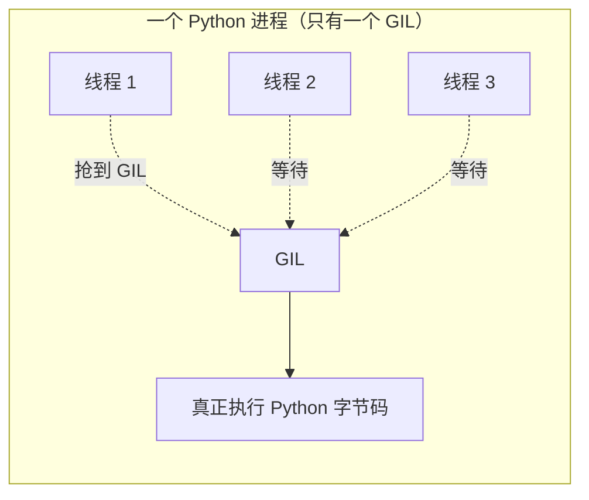
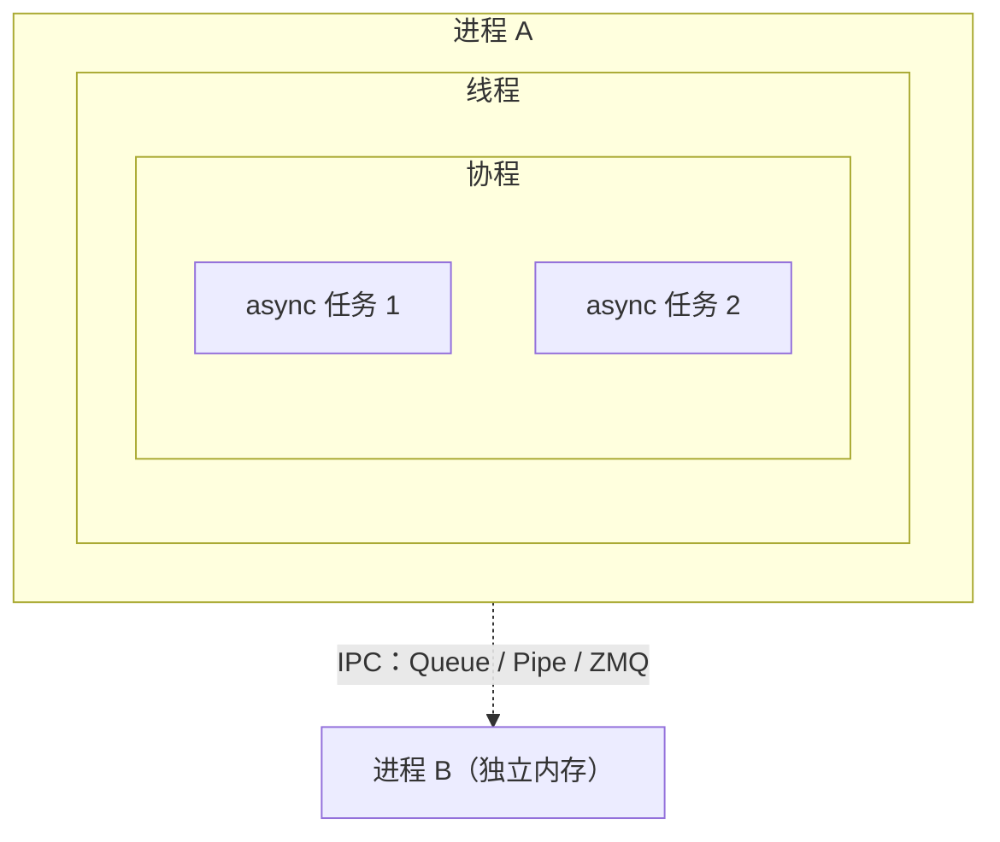
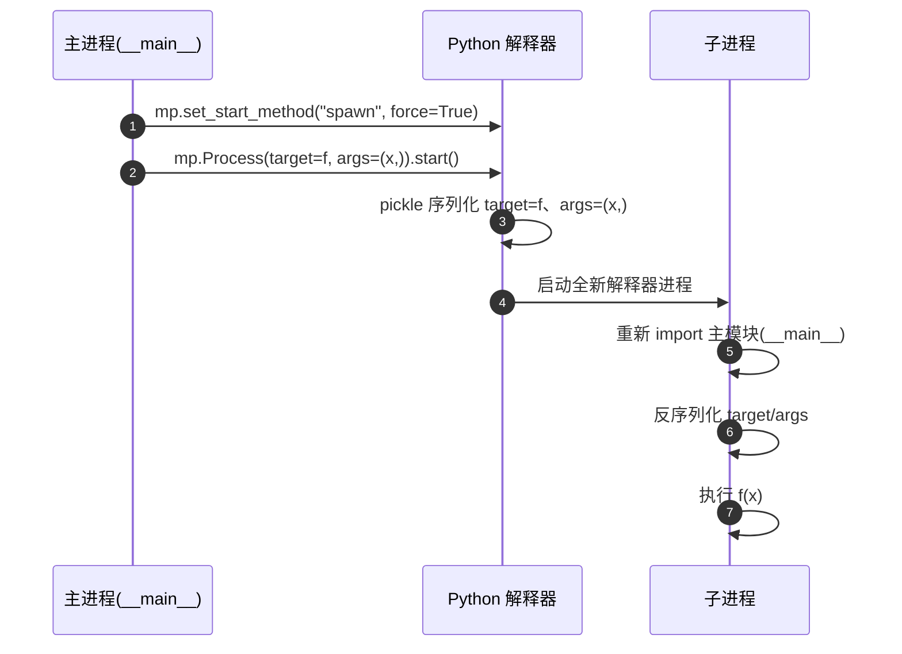
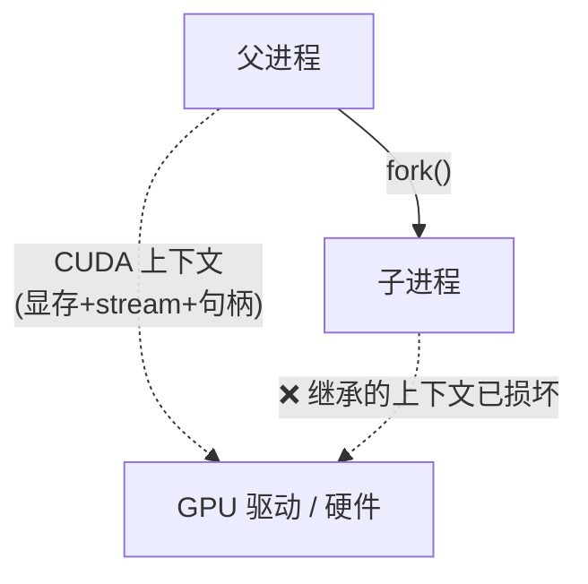
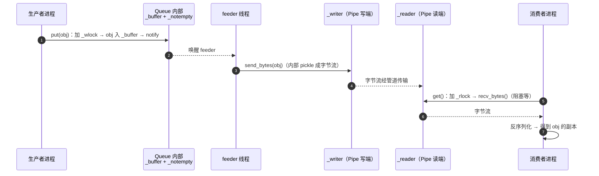
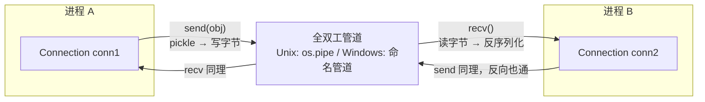
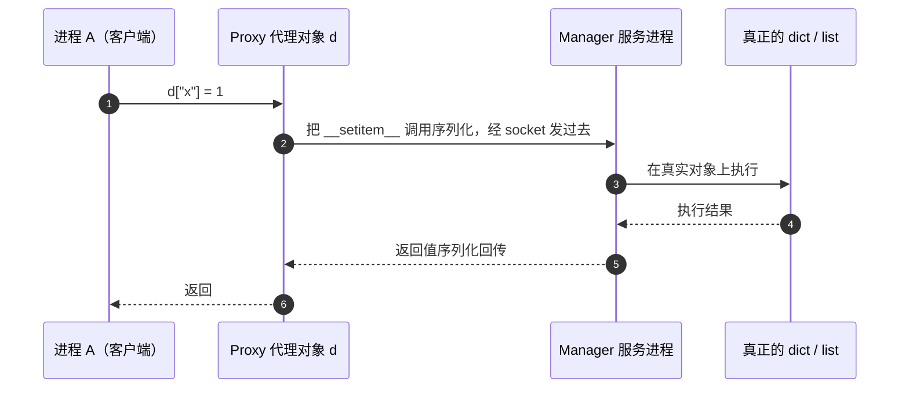
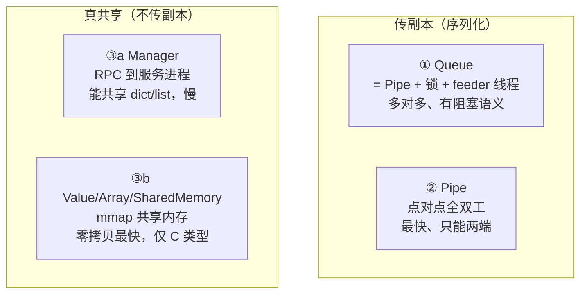
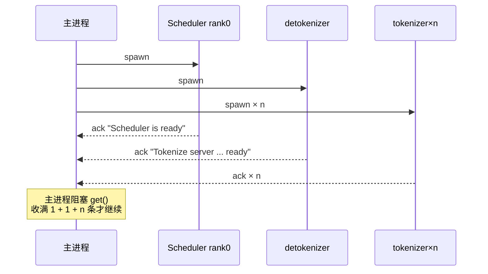

# Python 多进程原理与 spawn 详解

> 配套 mini-sglang 源码学习。本文讲清 Python 多进程的底层原理，重点剖析项目启动时用到的 `spawn`，并对照 [launch.py](python/minisgl/server/launch.py) 逐行拆解。

## 目录

1. [为什么要多进程：GIL 这道坎](#一为什么要多进程gil-这道坎)
2. [进程 / 线程 / 协程三种并发模型](#二进程--线程--协程三种并发模型)
3. [multiprocessing 三种启动方式](#三multiprocessing-三种启动方式)
4. [spawn 深入剖析（重点）](#四spawn-深入剖析重点)
5. [multiprocessing 常用 API 速查](#五multiprocessing-常用-api-速查)
6. [进程间通信（IPC）](#六进程间通信ipc)
7. [mini-sglang 实战：launch.py 逐行拆解](#七mini-sglang-实战launchpy-逐行拆解)
8. [常见坑与最佳实践](#八常见坑与最佳实践)

---

## 一、为什么要多进程：GIL 这道坎

**GIL（Global Interpreter Lock，全局解释器锁）** 是 CPython 解释器内部的一把互斥锁：**同一时刻，只允许一个线程执行 Python 字节码**。



**结论**：

- **CPU 密集型任务**（算矩阵、跑模型）用多线程**无法提速**——因为 GIL 让线程串行执行，反而多了切换开销。
- **IO 密集型任务**（网络请求、读写磁盘）用多线程**可以提速**——线程在等 IO 时会释放 GIL，别的线程能趁机执行。
- **绕开 GIL 的办法**：用**多进程**，每个进程有独立的解释器、独立的 GIL，真正并行。mini-sglang 里 API Server、Scheduler、tokenizer 各自是独立进程，靠这个实现了「调度 + 计算」的隔离与并行。

> 补充：Python 3.12+ 的 `--disable-gil`、以及 numpy / PyTorch 等 C 扩展在底层会主动释放 GIL 做重计算，是另外两条「曲线救国」的路，但都不改变「Python 层多线程受 GIL 限制」这个基本面。

---

## 二、进程 / 线程 / 协程三种并发模型

| 维度 | 进程 Process | 线程 Thread | 协程 Coroutine |
|---|---|---|---|
| **调度者** | 操作系统 | 操作系统 | 程序自己（事件循环） |
| **内存空间** | 独立，不共享 | 共享（同进程内） | 共享 |
| **通信成本** | 高（需 IPC） | 低（共享内存，但需加锁） | 极低（直接访问变量） |
| **创建/切换开销** | 大 | 中 | 小 |
| **能否用多核** | 能（真并行） | 受 GIL 限制 | 单线程，不能 |
| **典型场景** | CPU 密集、需要隔离 | IO 密集、多核 C 扩展 | 海量 IO、异步网络 |
| **本项目对应** | Scheduler、tokenizer | 少用 | API Server 的 asyncio |



> 一句话：**进程隔离内存、线程共享内存、协程单线程内切换**。mini-sglang 里「进程」负责隔离（每个 Scheduler 独立 CUDA 上下文），「协程」负责 API Server 的异步 HTTP。

---

## 三、multiprocessing 三种启动方式

Python 的 `multiprocessing` 提供三种**启动子进程**的方式（start method），核心区别是「子进程怎么诞生、继承什么」。

### 3.1 fork（Unix 默认）


- **原理**：`fork()` 直接复制父进程的地址空间，用**写时复制（Copy-On-Write）** 优化——子进程只在「真的要写」时才复制那页内存。
- **优点**：快（不需要重新 import）、能继承父进程的一切。
- **缺点**：继承得太彻底，**把不该继承的也带走了**（线程状态、锁、CUDA 上下文、网络连接）。

### 3.2 spawn（Windows/macOS 默认，也是本项目用的）


- **原理**：启动一个**全新**的 Python 解释器，通过 `pickle` 序列化把要执行的函数（`target`）和参数（`args`）传过去，子进程重新 `import` 主模块后执行。
- **优点**：**干净**——子进程从零开始，不会继承脏状态。
- **缺点**：慢（要重新 import 所有模块）、且 `target`/`args` 必须**可 pickle**。

### 3.3 forkserver

- **原理**：预先启动一个「干净的 server 进程」，之后每次需要子进程都从它 fork，而不是从主进程 fork。
- **定位**：折中方案——既比 spawn 快，又比 fork 干净（避免继承主进程的脏状态）。

### 3.4 对比总表

| 启动方式 | 速度 | 继承状态 | 平台 | 适用场景 |
|---|---|---|---|---|
| **fork** | 快 | 全部继承（含脏状态） | Unix | 简单、无 CUDA/多线程的脚本 |
| **spawn** | 慢 | 不继承 | 全平台 | **CUDA / 多线程 / 需要干净环境** |
| **forkserver** | 中 | 只继承干净 server | Unix | 需要干净 + 频繁 fork |

---

## 四、spawn 深入剖析（重点）

### 4.1 spawn 的完整流程



### 4.2 为什么 spawn 必须加 `if __name__ == "__main__"` 保护

这是 spawn 方式**最经典的坑**。子进程启动后会**重新 import 主模块**——如果主模块顶层的「创建子进程」代码不在 `if __name__ == "__main__"` 里，子进程 import 时又会去创建子进程，导致**无限递归 spawn**。

```python
# ❌ 错误：子进程 import 时会再次执行这行，递归 spawn
p = mp.Process(target=worker)
p.start()

# ✅ 正确：只有主进程才会执行这段
if __name__ == "__main__":
    p = mp.Process(target=worker)
    p.start()
```

> mini-sglang 的 [launch.py](python/minisgl/server/launch.py) 末尾正是这么写的：
> ```python
> if __name__ == "__main__":
>     launch_server()
> ```
> 而 `__main__.py` 里则用 `assert __name__ == "__main__"` 兜底，防止被误 import。

### 4.3 为什么 CUDA 程序必须用 spawn（核心）

**CUDA 上下文（CUDA Context）是进程内的状态**，包含显存分配、CUDA stream、Event、cublas/cudnn 句柄等，它不是普通内存，而是和 GPU 驱动、硬件绑定的资源。



**fork 的问题**：子进程 fork 后继承了父进程的 CUDA 上下文指针，但这个上下文在子进程里是**无效**的（驱动不认识这个「复制出来的」上下文）。PyTorch 会直接报错：

```
RuntimeError: Cannot re-initialize CUDA in forked subprocess.
To use CUDA with multiprocessing, you must use the 'spawn' start method.
```

**spawn 的解法**：子进程从零启动、重新 import、重新初始化 CUDA——每个进程拿到自己**独立、干净**的 CUDA 上下文。这正是 mini-sglang 每个 Scheduler rank 能独占一块 GPU 显存、各自初始化模型的原因。

> 源码佐证：[launch.py:52](python/minisgl/server/launch.py#L52) `mp.set_start_method("spawn", force=True)`，以及 `_run_scheduler` 里在子进程内部才 `import torch`、创建 `Scheduler`（触发 CUDA 初始化）。

### 4.4 `set_start_method` 的几个细节

```python
mp.set_start_method("spawn", force=True)  # 全局设置，force 覆盖已有设置
```

- **必须在创建进程前调用**，且一个进程里只能设一次（除非 `force=True`）。
- `force=True`：即使已经设置过，也强制覆盖。mini-sglang 用 `force=True` 是因为可能被第三方库先设置过。
- 也可以用 `mp.get_context("spawn")` 拿到局部 context，只在局部用 spawn，不影响全局。

---

## 五、multiprocessing 常用 API 速查

### 5.1 Process —— 创建子进程

```python
import multiprocessing as mp

def worker(x):
    print(f"worker got {x}")

if __name__ == "__main__":
    p = mp.Process(
        target=worker,      # 子进程要执行的函数
        args=(42,),         # 位置参数（tuple）
        kwargs={},          # 关键字参数
        name="my-worker",   # 进程名（ps 能看到）
        daemon=False,       # 是否守护进程
    )
    p.start()    # 启动（此刻才真正 spawn）
    p.join()     # 等待子进程结束
```

### 5.2 daemon 参数

| daemon | 行为 |
|---|---|
| `True` | 主进程退出时，子进程被**立即强杀**（不等它收尾） |
| `False` | 子进程正常跑完；主进程默认会等非 daemon 子进程 |

mini-sglang 用 `daemon=False`（[launch.py:67](python/minisgl/server/launch.py#L67)），让 Scheduler/tokenizer 能正常收尾（释放 GPU、关闭 ZMQ 连接），而不是被主进程一刀切。

### 5.3 进程间通信的三件套

先记住一句话：**Queue / Pipe 传的是「对象副本」（靠 pickle 序列化），Manager 是「逻辑共享」（实为 RPC 到一个服务进程），真正的共享内存只有 `Value` / `Array` / `SharedMemory`**。三者底层完全不同，别混为一谈。

```python
# ① Queue：多生产者/多消费者队列（底层 = Pipe + 锁 + feeder 线程）
q = mp.Queue()
q.put(obj)      # 放（自动 pickle）
obj = q.get()   # 取（阻塞等待）

# ② Pipe：点对点双向管道（更快，但只能两端）
parent, child = mp.Pipe()
parent.send(obj); child.recv()

# ③ 共享内存 / Manager：共享可变状态（注意要加锁）
with mp.Manager() as m:
    d = m.dict()   # 跨进程共享的 dict
    lst = m.list()
```

下面逐个拆开它们的**通信路径**。

#### ① Queue：Pipe + 锁 + feeder 线程的「接力」

`mp.Queue()` 内部不是简单的队列，而是几个部件拼起来的：

- `_writer` / `_reader`：一条底层 **Pipe** 的两个端点（负责真正搬运字节）。
- `_wlock` / `_rlock`：写、读各一把锁（保证多生产者/多消费者线程安全）。
- `_buffer`（`collections.deque`）：内存里暂存待发送的对象。
- `_notempty`（`threading.Condition`）：条件变量，用来唤醒 feeder 线程。
- `_feeder`：一个**后台 feeder 线程**，专门把 buffer 里的对象 pickle 后写进管道。



**为什么要有 feeder 线程？** `put` 只负责把对象塞进内存 buffer 就返回，真正慢的 pickle + 写管道交给后台线程异步做——这样**生产者和写管道解耦**，多生产者并发 put 也不会阻塞在管道写上面。代价是每个 `Queue` 会额外占一个线程。

#### ② Pipe：两端直连的全双工字节管道

`mp.Pipe()` 返回 `(conn1, conn2)` 两个 `Connection` 对象，它们包住同一条底层管道（Unix 是 `os.pipe()`，Windows 是命名管道）。`Connection` 负责 pickle/反序列化，把「收发对象」变成「读写字节流」。



- **全双工**：两端都能 `send` / `recv`，双向同时通。
- **点对点**：只有两端，没有中间队列；`send` 时对方没在 `recv` 也没关系（字节留在管道缓冲里），但**只能一个消费者**。
- 比 Queue 快（少一把锁、少一个 feeder 线程、少一层 buffer），所以 `Queue` 干脆拿它当底层管道。

#### ③ Manager / 共享内存：从「传副本」到「真共享」

`Manager` 和「共享内存」其实是**两码事**，前者常被误解成后者。

**Manager 的本质是 RPC**：`mp.Manager()` 会拉起一个**独立的管理服务进程**，真正的 `dict`/`list` 住在那个进程里。你手上的 `d` 只是个 **Proxy（代理）**——它不存数据，只存一条到服务进程的连接。每次读写，Proxy 都把「方法调用」序列化发过去，由服务进程在真实对象上执行后再把结果传回来：



所以 Manager 的「共享」是**逻辑共享**（大家都操作同一个对象），但**每次访问都是一次 RPC 往返**，很慢，只适合低频的复杂可变状态。

**真·共享内存**则是 `multiprocessing.Value` / `Array` / `multiprocessing.shared_memory.SharedMemory`：把一块 **mmap 内存映射到每个进程的地址空间**，大家直接读写**同一块物理内存**——零序列化、零 RPC、最快，但**只支持 C 基本类型**（int/float/byte 数组），复杂对象放不进去，且需要自己加锁（配合 `mp.Lock`）。

#### 三件套总览



| 机制 | 底层 | 副本还是共享 | 特点 | 适用 |
|---|---|---|---|---|
| **Queue** | Pipe + 锁 + feeder 线程 + buffer | 副本（pickle） | 多对多、线程安全、阻塞/超时语义 | 就绪同步、任务分发 |
| **Pipe** | os.pipe / 命名管道 + Connection | 副本（pickle） | 点对点全双工、最快 | 两进程直连 |
| **Manager** | 独立服务进程 + Proxy(RPC) | 逻辑共享（RPC） | 能共享复杂对象，每次访问都是往返 | 低频复杂可变状态 |
| **Value/Array/SharedMemory** | mmap 共享内存 | 真共享（同块物理内存） | 零拷贝零序列化，仅 C 基本类型 | 高频共享标量/数组 |

> **关键区别**：`Queue` / `Pipe` 传的是**对象副本**（pickle 序列化后传过去），不是共享引用；`Manager` 是「逻辑共享」但要过 RPC；`Value` / `Array` / `SharedMemory` 才是真·共享内存。mini-sglang 的 `ack_queue` 是 `mp.Queue[str]`，用它做「子进程就绪 → 通知主进程」的一次性同步——正因为它自带锁和阻塞 `get()`，天然适合「多生产者发 ack、单消费者主进程收齐」这个场景。

---

## 六、进程间通信（IPC）

### 6.1 原生 multiprocessing 通信 vs ZMQ

| | multiprocessing.Queue / Pipe | ZMQ |
|---|---|---|
| **定位** | Python 进程内简单通信 | 通用高性能消息队列 |
| **性能** | 一般（每次 pickle + 加锁） | 高（零拷贝、多模式） |
| **模式** | 队列 / 管道 | PUSH/PULL、PUB/SUB、REQ/REP 等 |
| **跨语言** | 否 | 是 |
| **适用** | 少量进程简单传值 | 生产级进程拓扑 |

mini-sglang 的**进程间主通信**选 **ZMQ**（因为要支持 PUB/SUB 广播、异步、高性能），而 **`mp.Queue` 只用于启动时的一次性「就绪确认」**（ack）。

### 6.2 序列化：跨进程传值的隐形门槛

任何跨进程传的对象都必须**可序列化**。`multiprocessing` 用 `pickle`，mini-sglang 的消息系统用「自研 `serialize_type` + msgpack」（见 [message/utils.py](python/minisgl/message/utils.py)）。


> 注意：传过去的是**副本**，进程 B 改它不影响进程 A。要共享可变状态必须用共享内存/Manager。

---

## 七、mini-sglang 实战：launch.py 逐行拆解

对照 [launch.py](python/minisgl/server/launch.py) 的 `start_subprocess()`：

```python
def start_subprocess() -> None:
    import multiprocessing as mp
    from minisgl.tokenizer import tokenize_worker

    # 1) 强制用 spawn —— 因为每个 Scheduler 要独立初始化 CUDA
    mp.set_start_method("spawn", force=True)

    world_size = server_args.tp_info.size
    # 2) 一个 mp.Queue 收子进程的"就绪"信号
    ack_queue: mp.Queue[str] = mp.Queue()

    # 3) 为每个 TP rank spawn 一个 Scheduler 进程
    for i in range(world_size):
        new_args = replace(
            server_args,
            tp_info=DistributedInfo(i, world_size),  # 每个进程拿不同的 rank
        )
        mp.Process(
            target=_run_scheduler,
            args=(new_args, ack_queue),
            daemon=False,
            name=f"minisgl-TP{i}-scheduler",
        ).start()

    # 4) detokenizer 进程（1 个）
    mp.Process(target=tokenize_worker, kwargs={...}, daemon=False,
               name="minisgl-detokenizer-0").start()
    # 5) tokenizer 进程（--num-tokenizer 个）
    for i in range(num_tokenizers):
        mp.Process(target=tokenize_worker, kwargs={...}, daemon=False,
                   name=f"minisgl-tokenizer-{i}").start()

    # 6) 阻塞等待所有子进程 ack，才返回继续跑 API Server
    for _ in range(num_tokenizers + 2):
        logger.info(ack_queue.get())
```

### 逐点讲解

| 代码 | 作用 | 对应原理 |
|---|---|---|
| `mp.set_start_method("spawn", force=True)` | 强制 spawn | CUDA 不能 fork（见 4.3） |
| `ack_queue = mp.Queue()` | 就绪同步队列 | Queue 的 put/get 阻塞特性 |
| `replace(server_args, tp_info=DistributedInfo(i, world_size))` | 每个 rank 拿到不同的 `tp_info` | 参数通过 args pickle 传给子进程，每个进程一份独立配置 |
| `daemon=False` | 子进程正常收尾 | 见 5.2 |
| `name=f"minisgl-TP{i}-scheduler"` | 进程名 | `ps aux` 能看到，方便调试 |
| `ack_queue.get()` 循环 | 阻塞等所有子进程就绪 | 主进程在「所有子进程就绪」前不对外服务 |

### ack 同步机制（为什么是 `num_tokenizers + 2` 次）

子进程就绪后各自 `put` 一条消息进 ack_queue（[launch.py:25](python/minisgl/server/launch.py#L25) 的 `_run_scheduler` 里 rank0 put、[server.py:57](python/minisgl/tokenizer/server.py#L57) 里 tokenizer/detokenizer put）：



- 总 ack 数 = **1（主 rank 的 Scheduler）+ 1（detokenizer）+ n（tokenizer）= n + 2**。
- 非主 rank 的 Scheduler **不 put**（只有 `tp_info.is_primary()` 才 put），所以 Scheduler 只贡献 1 条 ack。

---

## 八、常见坑与最佳实践

| 坑 | 现象 | 解法 |
|---|---|---|
| **fork + CUDA** | `Cannot re-initialize CUDA in forked subprocess` | 用 `spawn`（本项目已做） |
| **漏 `if __name__` 保护** | spawn 下无限递归创建子进程 / 子进程重复执行 | 所有「创建进程」代码放进 `if __name__ == "__main__"` |
| **Windows 上行为不同** | Windows 默认 spawn（无 fork），Linux 默认 fork | 跨平台代码显式 `set_start_method("spawn")` |
| **以为 Queue 传的是共享对象** | 改了子进程里的对象，父进程没变化 | 理解「传副本」，要共享用 Manager/共享内存 |
| **target/args 不可 pickle** | `PicklingError` | 传可序列化的参数（如 lambda、生成器、本地类都可能不可 pickle） |
| **daemon=True 丢数据** | 主进程退出，子进程没写完就被杀 | 需要收尾的子进程用 `daemon=False` + `join()` |
| **主进程不退** | 非 daemon 子进程还活着，主进程卡住 | 确保子进程有退出条件，或手动 `terminate()` |

### 最佳实践速记

1. **GPU / 多线程程序一律 `spawn`**，且放在 `if __name__ == "__main__"` 里。
2. **跨进程通信优先考虑成熟方案**（ZMQ / Ray），`mp.Queue` 只做轻量同步。
3. **进程间传的是副本**，需要共享状态时明确用共享内存/Manager 并加锁。
4. **给进程起名字**（`name=`），`ps` 一查就知道拓扑对不对。
5. **用 ack/就绪队列** 保证所有子进程就绪后再对外服务，避免「还没起来就接流量」。

---

## 参考

- Python 官方文档：[multiprocessing](https://docs.python.org/3/library/multiprocessing.html) 的 Contexts and start methods 一节
- PyTorch 官方文档：[Multiprocessing best practices](https://pytorch.org/docs/stable/notes/multiprocessing.html)（spawn 与 CUDA 的说明）
- 本项目：[launch.py](python/minisgl/server/launch.py)、[message/utils.py](python/minisgl/message/utils.py)、[utils/mp.py](python/minisgl/utils/mp.py)
