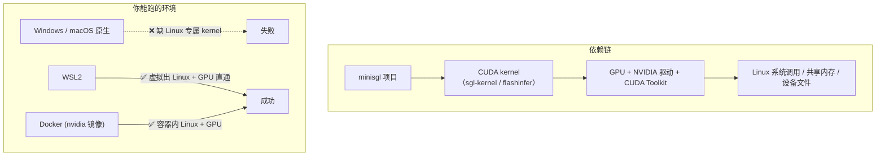

# Step 0 实验手册：部署 + 分步实验

> 配套 [STEP0_跑起来与全局地图.md](STEP0_跑起来与全局地图.md) 使用。
> 理论看再多，不如亲手把链路跑一遍。本文从「装环境」到「逐条验证消息流」，按顺序做即可。

## 目录

1. [环境部署](#一环境部署)
2. [实验 1：dummy 权重跑通 HTTP 链路](#二实验-1dummy-权重跑通-http-链路)
3. [实验 2：真实权重 + 交互 shell](#三实验-2真实权重--交互-shell)
4. [实验 3：验证进程拓扑](#四实验-3验证进程拓扑)
5. [实验 4：curl 抓 SSE 原始输出](#五实验-4curl-抓-sse-原始输出)
6. [实验 5：多卡 --tp 2](#六实验-5多卡---tp-2)
7. [实验 6（进阶）：加日志观察消息流](#七实验-6进阶加日志观察消息流)

---

## 一、环境部署

### 1.1 依赖链（为什么装起来有门槛）



**术语**：

| 术语 | 说明 |
|---|---|
| **CUDA kernel** | 跑在 GPU 上的计算函数（`.cu` 源文件编译出的机器码）。项目用 `sgl-kernel`、`flashinfer` 这两个库提供高性能算子（FlashAttention、采样等），它们只发布 Linux 版本。 |
| **WSL2** | Windows 的「Linux 子系统」，能在 Windows 里跑一个真正的 Linux 内核，并支持 GPU 直通（CUDA on WSL）。 |
| **--dummy-weight** | 用 `torch.randn_like` 生成随机权重，跳过模型下载。**只测链路通不通，不测生成质量**。对应源码 [engine.py:139-144](python/minisgl/engine/engine.py#L139-L144) 的 `_load_weight_state_dict`。 |

### 1.2 方式一：本地 Linux（最直接）

前置：NVIDIA 驱动 + CUDA Toolkit（版本要匹配 `nvidia-smi` 显示的能力，因为 kernel 是 **JIT 编译**的）。

```bash
# 1) 验证 GPU 可用
nvidia-smi

# 2) 建虚拟环境（Python 3.10+，推荐 uv）
uv venv --python=3.12
source .venv/bin/activate

# 3) 安装项目（-e 可编辑安装，方便改源码）
git clone https://github.com/sgl-project/mini-sglang.git
cd mini-sglang
uv pip install -e .

# 4) 验证 PyTorch 能看见 GPU
python -c "import torch; print(torch.cuda.is_available(), torch.cuda.device_count())"
# 期望输出：True 1（或你的 GPU 数）
```

### 1.3 方式二：WSL2（Windows 用户）

```powershell
# PowerShell（管理员）装 WSL2
wsl --install
```

装好后在 WSL2 终端里装 CUDA（参考 [NVIDIA WSL2 CUDA 指南](https://docs.nvidia.com/cuda/wsl-user-guide/index.html)），之后步骤同「方式一」。

### 1.4 方式三：Docker

前置：Docker + NVIDIA Container Toolkit。

```bash
# 构建镜像（Dockerfile 里已配好依赖）
docker build -t minisgl .

# 起 HTTP 服务
docker run --gpus all -p 1919:1919 minisgl --model Qwen/Qwen3-0.6B --host 0.0.0.0

# 交互 shell
docker run -it --gpus all minisgl --model Qwen/Qwen3-0.6B --shell-mode
```

> 建议挂卷缓存模型和 JIT 编译产物，避免每次重建：`-v huggingface_cache:/app/.cache/huggingface -v tvm_cache:/app/.cache/tvm-ffi`。

### 1.5 常见坑

| 现象 | 原因 / 解法 |
|---|---|
| 下载模型超时/失败 | HuggingFace 网络问题，加 `--model-source modelscope` 走国内源 |
| 首次启动很慢 | CUDA kernel 是 JIT 编译，第一次要现场编译，之后有缓存 |
| 外部访问不了 | 默认只监听 `127.0.0.1`，加 `--host 0.0.0.0`；端口默认 1919，`--port` 改 |
| `--shell` 报 unrecognized | 参数名是 `--shell-mode`（或用 `python -m minisgl.shell`） |
| shell 下 `--dummy-weight` 报 assert | shell 模式不支持 dummy 权重，见 [实验 1](#二实验-1dummy-权重跑通-http-链路) |

---

## 二、实验 1：dummy 权重跑通 HTTP 链路

> 不下载模型，最快验证「请求能进、能出」。

```bash
# 终端 1：起服务（默认 127.0.0.1:1919）
python -m minisgl --model Qwen/Qwen3-0.6B --dummy-weight
```

```bash
# 终端 2：发请求（/generate 是裸文本流，最简单）
curl -N http://127.0.0.1:1919/generate \
  -H "Content-Type: application/json" \
  -d '{"prompt":"hello world","max_tokens":8}'
```

**预期**：流式吐出一串 token（dummy 权重下是**乱码**，没关系，说明链路通了）。

> 判断标准：能看到 `data: ...` 逐条返回、最后以 `data: [DONE]` 结束，即代表「API Server → tokenizer → scheduler → detokenizer → API Server」整条链路打通。

---

## 三、实验 2：真实权重 + 交互 shell

> 需要联网下载模型（Qwen3-0.6B 很小，约 1.2GB）。

```bash
python -m minisgl --model Qwen/Qwen3-0.6B --shell-mode
# 或等价：python -m minisgl.shell --model Qwen/Qwen3-0.6B
```

进入 `$ ` 提示符后，输入问题即可看到**有意义**的流式回复。

shell 内置命令：`/reset` 清空多轮历史，`/exit` 退出。

---

## 四、实验 3：验证进程拓扑

> 把 [进程拓扑图](STEP0_跑起来与全局地图.md#二进程拓扑) 和真实进程对上号。

```bash
# 起服务后，另开终端（Linux/WSL2）：
ps aux | grep minisgl
```

**预期**（`--tp 1` 默认）：

```
... minisgl-TP0-scheduler      # 1 个 Scheduler（rank 0）
... minisgl-detokenizer-0      # tokenizer + detokenizer 合并的进程
# 主进程本身没有 minisgl 前缀，它就是 API Server
```

> 进程名对应源码 [launch.py:59-103](python/minisgl/server/launch.py#L59-L103) 的 `mp.Process(..., name=...)`。

---

## 五、实验 4：curl 抓 SSE 原始输出

> 亲手看一遍流式协议长什么样，对照 [api_server.py](python/minisgl/server/api_server.py) 的 `stream_chat_completions`。

```bash
curl -N http://127.0.0.1:1919/v1/chat/completions \
  -H "Content-Type: application/json" \
  -d '{"model":"Qwen/Qwen3-0.6B","messages":[{"role":"user","content":"用一句话介绍你自己"}],"max_tokens":16,"stream":true}'
```

**预期**（`-N` 关缓冲，能看到逐条 `data:` 出现）：

```
data: {"id":"cmpl-0","object":"text_completion.chunk","choices":[{"delta":{"role":"assistant"},"index":0,"finish_reason":null}]}

data: {"id":"cmpl-0","object":"text_completion.chunk","choices":[{"delta":{"content":"我是"},"index":0,"finish_reason":null}]}

...

data: {"id":"cmpl-0","object":"text_completion.chunk","choices":[{"delta":{},"index":0,"finish_reason":"stop"}]}

data: [DONE]
```

**对照源码**：每个 `data:` chunk 对应 `stream_chat_completions` 里 `yield f"data: {json.dumps(chunk)}\n\n"`；`[DONE]` 对应 `yield b"data: [DONE]\n\n"`。非流式（`stream:false`）则收集全部 chunk 拼成一次 JSON 返回（`v1_completions` 后半段）。

---

## 六、实验 5：多卡 --tp 2

> 需要 **2 张 GPU**。观察「rank0 对外、rank1 只计算」的分工。

```bash
python -m minisgl --model Qwen/Qwen3-0.6B --tp 2
```

```bash
ps aux | grep minisgl
# 预期多出：minisgl-TP0-scheduler 和 minisgl-TP1-scheduler
```

```bash
# 发请求，仍只和 rank0 交互
curl -N http://127.0.0.1:1919/v1/chat/completions \
  -H "Content-Type: application/json" \
  -d '{"model":"Qwen/Qwen3-0.6B","messages":[{"role":"user","content":"hi"}],"max_tokens":8,"stream":true}'
```

> 单 GPU 无法测 `--tp 2`，此时只需理解 [多卡拓扑](STEP0_跑起来与全局地图.md#23-多卡拓扑--tp-4) 即可，张量并行细节留到 Step 17。

---

## 七、实验 6（进阶）：加日志观察消息流

> 想亲眼看到 ②③⑥⑦ 四条消息在进程间流动，可以在关键函数里临时加 `logger.debug_rank0(...)`（或 `logger.info_rank0`）。

建议插入点：

| 位置 | 观察什么 |
|---|---|
| [api_server.py](python/minisgl/server/api_server.py) `send_one` | ② `TokenizeMsg` 发出 |
| [tokenize.py](python/minisgl/tokenizer/tokenize.py) `tokenize` | ③ `UserMsg` 发出 |
| [scheduler.py](python/minisgl/scheduler/scheduler.py) `_process_one_msg` | 收到 `UserMsg` |
| [scheduler.py](python/minisgl/scheduler/scheduler.py) `_process_last_data` | ⑥ `DetokenizeMsg` 发出 |
| [detokenize.py](python/minisgl/tokenizer/detokenize.py) `detokenize` | ⑦ `UserReply` 发出 |

> 日志用 `logger.debug_rank0` 而非 `logger.debug`，是为了多卡时只在 rank0 打印，避免刷屏（对应路线图「调试与验证技巧」）。
