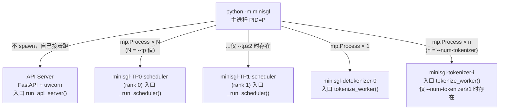
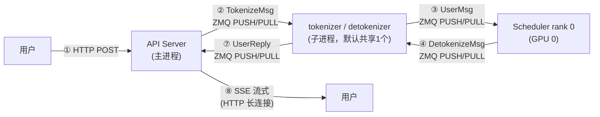
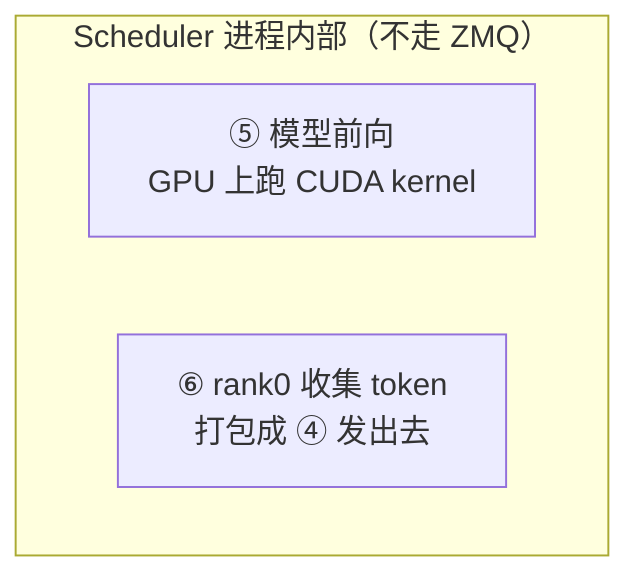
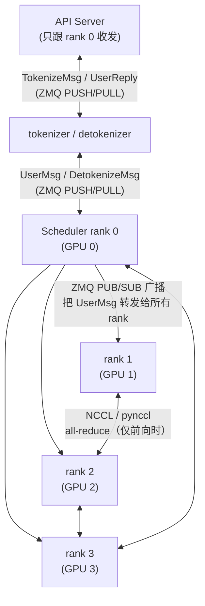
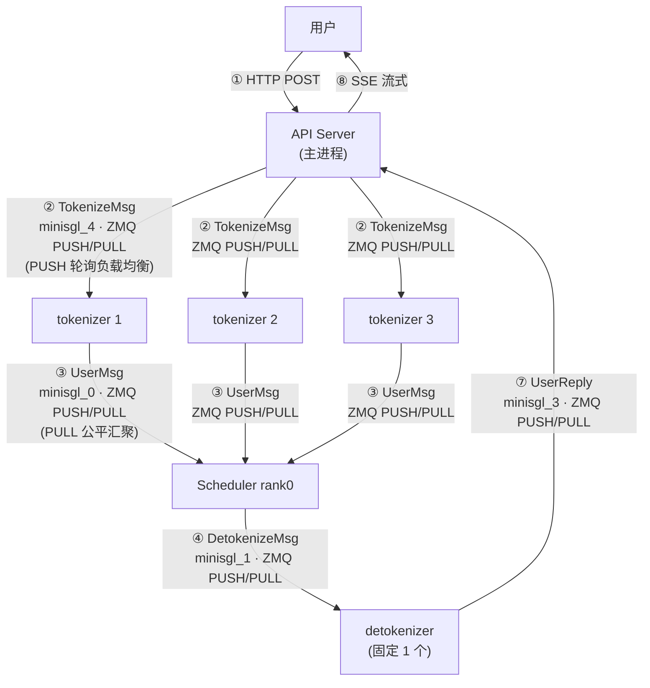
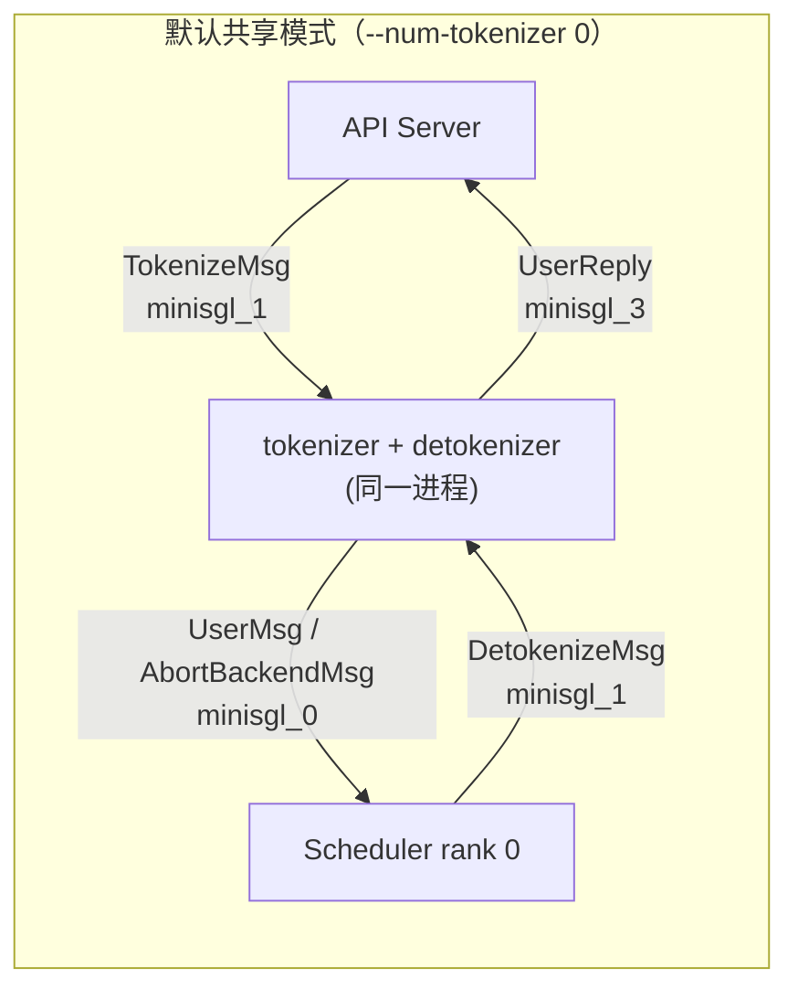
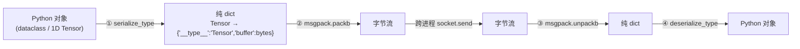
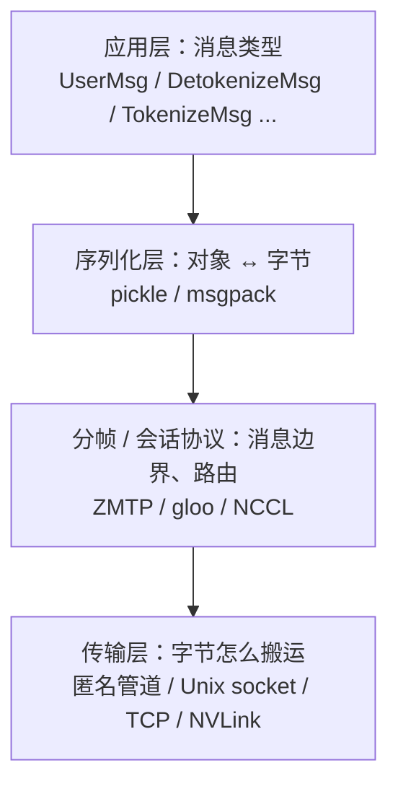
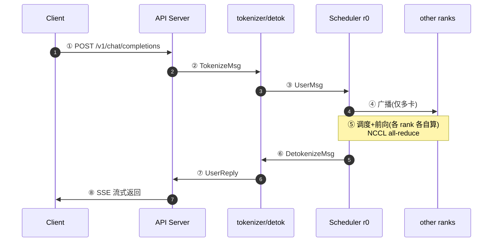
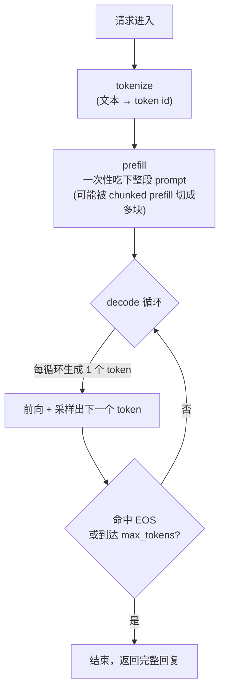

# Step 0 深入分析：跑起来 + 建立全局地图

> 本文是对 [LEARNING_ROADMAP.md](LEARNING_ROADMAP.md) 中 **Step 0** 的展开精读。
> 目标：把「一个请求从进来到出去」这条主线，先用**流程图 / 示意图**焊死在脑子里，再逐个讲清沿途的**专有名词**。
> 后续 Step 1~24 都是在往这张图里填细节。

---

## 目录

1. [先跑通](#一先跑通)
2. [进程拓扑](#二进程拓扑)
3. [请求生命周期（主线）](#三请求生命周期)
4. [专有名词详解](#四专有名词详解)
5. [Step 0 检查点自测](#五step-0-检查点自测)

> 📋 部署与分步实验已拆到独立文档：[STEP0_实验手册.md](STEP0_实验手册.md)

---

## 一、先跑通

> 目标：一条命令把服务跑起来，确认链路通。**详细部署步骤和分步实验见 [STEP0_实验手册.md](STEP0_实验手册.md)。**

```bash
# 方式 A：真实权重 + 交互 shell（需联网下载模型）
python -m minisgl --model Qwen/Qwen3-0.6B --shell-mode

# 方式 B：dummy 随机权重 + HTTP 服务（不下载模型，只测链路）
python -m minisgl --model Qwen/Qwen3-0.6B --dummy-weight
```

> ⚠️ **两个高频坑**（源码佐证）：
> 1. 命令行参数是 `--shell-mode`，不是 `--shell`（见 [args.py:221](python/minisgl/server/args.py#L221)）；也可直接 `python -m minisgl.shell` 进入 shell。
> 2. **shell 模式不支持 `--dummy-weight`**：`run_api_server` 里有 `assert not config.use_dummy_weight`（[api_server.py:425](python/minisgl/server/api_server.py#L425)）。要测 dummy 链路，请用 HTTP 服务模式（方式 B）。
>
> 平台前提：依赖 Linux 专属 CUDA kernel（`sgl-kernel` / `flashinfer`），Windows/macOS 需用 WSL2 或 Docker，详见 [STEP0_实验手册.md](STEP0_实验手册.md) 的「环境部署」。

---

## 二、进程拓扑

> 一句话：**主进程自己当 API Server，再 `spawn` 出「N 个 Scheduler + 1 个 detokenizer + n 个 tokenizer」子进程，全靠 ZMQ 消息通信。**

### 2.1 启动时 spawn 出哪些进程

源码：[launch.py](python/minisgl/server/launch.py) 的 `launch_server()` → `start_subprocess()`。



**对应源码关键行**（[launch.py](python/minisgl/server/launch.py)）：

| 进程 | 入口函数 | 进程名 | 数量 |
|---|---|---|---|
| Scheduler | `_run_scheduler` | `minisgl-TP{i}-scheduler` | `world_size = --tp` |
| Detokenizer | `tokenize_worker` | `minisgl-detokenizer-0` | 固定 1 个 |
| Tokenizer | `tokenize_worker` | `minisgl-tokenizer-{i}` | `--num-tokenizer` 个（默认 0） |

> **默认 `--num-tokenizer 0`**：不额外起 tokenizer，tokenizer 与 detokenizer **合并成一个进程**（就是那个 `minisgl-detokenizer-0`）。所以默认拓扑是「1 个 API Server + 1 个 Scheduler + 1 个 tokenizer/detokenizer 混合进程」。

### 2.2 单卡拓扑（--tp 1，默认）

三个进程靠三条 ZMQ 链路连起来，**箭头 = 消息流向 + 通信方式**：



**等价的 ASCII 图**（和路线图一致，便于在纯文本环境看；②③④⑦ 均为 ZMQ PUSH/PULL，① 为 HTTP、⑧ 为 SSE）：

```
           ① HTTP 请求           ② TokenizeMsg            ③ UserMsg
用户 ──────────────► ┌────────────┐ ───────────► ┌────────────────────┐ ───────────► ┌──────────────┐
                    │ API Server │              │ tokenizer/detokenizer│              │  Scheduler   │
用户 ◄────────────── │  (主进程)   │ ◄─────────── │ (子进程, 默认共享1个) │ ◄─────────── │  (rank 0)    │
           ⑧ SSE流式  └────────────┘   ⑦ UserReply │                    │ ④ DetokenizeMsg│  (GPU 0)     │
                                                    └────────────────────┘              └──────────────┘
```

**图外还有两步**：



> **理解点**：⑤⑥ 发生在 Scheduler 进程**内部**，是「GPU 计算 + 本地 CPU 打包」，不经过 ZMQ 网络；只有 ②③④⑦ 是跨进程消息。

### 2.3 多卡拓扑（--tp 4）

多了「Scheduler 之间」的通信，其余和单卡一致：



**要点**：**只有 rank 0 对外收发消息**，rank 1..N 只做「收广播 + 各自前向 + NCCL 通信」。

### 2.4 拆分模式：n 个 tokenizer 时的进程架构

> 默认 `--num-tokenizer 0` 时 tokenizer 与 detokenizer 合并成一个进程（见 2.2）。当 `--num-tokenizer n`（n ≥ 1）时，tokenizer **拆成 n 个独立进程**，专门并行做分词；detokenizer 仍是固定 1 个。

**进程拓扑**（以 n=3 为例）：



**和共享模式（2.2）的区别**：

| | 共享模式（默认） | 拆分模式（n ≥ 1） |
|---|---|---|
| tokenizer / detokenizer | 同一个进程 | 拆成 n + 1 个进程 |
| 是否用 `minisgl_4` | 否（复用 `minisgl_1`） | 是（专门走 tokenize） |
| `minisgl_1` 收什么 | `TokenizeMsg` + `DetokenizeMsg` 两类 | 只收 `DetokenizeMsg` |
| 分词并发度 | 1（单进程串行） | n（并行 + 负载均衡） |

**为什么要拆 n 个 tokenizer？**

分词（tokenize）是 **CPU 密集**任务——长 prompt 要逐个 token 切分，请求一多，单个 tokenizer 进程会成瓶颈。拆成 n 个进程，配合 ZMQ 的 PUSH/PULL **负载均衡**，把分词压力分摊到 n 个核上：

- **fan-out（分发）**：API Server 的 PUSH（`send_tokenizer`）`bind` 在 `minisgl_4`，n 个 tokenizer 的 PULL 都 `connect` 到它 → PUSH 把 `TokenizeMsg` **轮询分发**给 n 个 tokenizer。
- **fan-in（汇聚）**：n 个 tokenizer 的 PUSH（`send_backend`）都 `connect` 到 `minisgl_0`，Scheduler rank0 的 PULL `bind` 它 → PULL **公平地**从 n 个 PUSH 各取消息。

**为什么 detokenizer 固定 1 个？**

解码（detokenize）发生在生成路径上——token 是**逐个串行**吐出来的，每个 uid 的 `UserReply` 还要按顺序回流给同一个 API Server 请求，没有「并行分词」那种可切分的压力，1 个进程足够，多进程反而要处理乱序问题。

**bind / connect 方向（拆分模式）**：

| 通道 | bind（create=True） | connect（create=False） |
|---|---|---|
| `minisgl_4`（API → tokenizer） | API Server | n 个 tokenizer |
| `minisgl_0`（tokenizer → rank0） | Scheduler rank0 | n 个 tokenizer |
| `minisgl_1`（rank0 → detokenizer） | Scheduler rank0 | detokenizer |
| `minisgl_3`（detokenizer → API） | API Server | detokenizer |

> 源码佐证：拆分模式由 `share_tokenizer`（即 `num_tokenizer == 0`）驱动，[args.py:22-47](python/minisgl/server/args.py#L22-L47) 里 `zmq_tokenizer_addr` 在拆分时切到 `minisgl_4`、`tokenizer_create_addr` 变 `False`、`frontend_create_tokenizer_link` 变 `True`；[launch.py:88-103](python/minisgl/server/launch.py#L88-L103) 用 `for` 循环 spawn 出 n 个 `minisgl-tokenizer-{i}` 进程。
>
> **拆分模式与多卡 TP 正交，可叠加**：`--tp 4 --num-tokenizer 3` 会得到 1 个 API Server + 4 个 Scheduler + 3 个 tokenizer + 1 个 detokenizer。

### 2.5 ZMQ 通道速查表（重绘 + 补充 bind/connect 语义）

> 每条 ZMQ 链路在源码里是一个 `ZmqXxxQueue` 对象，`create=True` 表示 **bind**（服务端，谁创建端点），`create=False` 表示 **connect**（客户端，谁去连）。



| 通道（`ipc:///tmp/` 前缀） | 方向 | 传什么 | bind（create=True） | connect（create=False） |
|---|---|---|---|---|
| `minisgl_4` | API Server → tokenizer | `TokenizeMsg` | API Server | tokenizer（**仅拆分模式**存在） |
| `minisgl_1` | API Server → tokenizer / rank0 → detokenizer | `TokenizeMsg` + `DetokenizeMsg` | 共享进程（共享时）/ rank0（拆分时） | API Server + rank0 |
| `minisgl_0` | tokenizer → rank0 | `UserMsg`、`AbortBackendMsg` | rank0 | tokenizer |
| `minisgl_3` | detokenizer → API Server | `UserReply` | API Server | detokenizer |
| `minisgl_2` | rank0 → rank1..N | 广播 `UserMsg` 等 | rank0（PUB） | rank1..N（SUB） |

> **为什么共享模式下 `minisgl_1` 一个地址收两类消息？**
> 源码里 `tokenize_worker` 主循环（[server.py:60-71](python/minisgl/tokenizer/server.py#L60-L71)）用 `isinstance` 把收到的消息分拣成 `DetokenizeMsg` / `TokenizeMsg` / `AbortMsg` 三类，分别交给 detokenize / tokenize / abort 三套逻辑处理——这就是 tokenizer 和 detokenizer 能合并成一个进程的原因。

**ZMQ 消息的序列化两段式**（源码 [message/utils.py](python/minisgl/message/utils.py) + [utils/mp.py](python/minisgl/utils/mp.py)）：



### 2.6 通信协议分层：三套路径各自用什么协议

> 2.4 讲的是「谁和谁通信、走哪条 ZMQ 通道」；这一节回答「**底层用什么协议**」。跨进程通信从来不是单一协议，而是**分层的一整条栈**。



项目里一共有**三套**跨进程通信路径，各用各的协议：

| 通信路径 | 传输层 | 分帧 / 会话协议 | 序列化 |
|---|---|---|---|
| **① 主通信**：API ↔ tokenizer ↔ Scheduler | Unix domain socket（`ipc://`） | **ZMTP**（ZMQ 自带） | **msgpack** + `serialize_type` |
| **② 启动同步**：子进程 → 主进程 ack | 匿名管道（`os.pipe()`） | pickle 自带消息边界 | **pickle** |
| **③ TP 多卡**：Scheduler rank 之间 | TCP（控制面）+ NVLink/PCIe（数据面） | **gloo**（控制面）/ **NCCL**（数据面） | 原生 tensor 二进制 |

**① 主通信（ZMQ 家族）**——占流量大头。`ipc://` 在 Linux 上就是 **Unix domain socket**（Windows 等价为命名管道），本机通信不跑完整网络栈，比 TCP 快；消息分帧与路由靠 ZMQ 自己的 wire protocol **ZMTP**；对象先用 `serialize_type` 转 dict 再 **msgpack** 打包（见 2.5 的两段式图）。

**② 启动同步（Python 原生）**——[launch.py](python/minisgl/server/launch.py) 的 `ack_queue` 是 `mp.Queue`，底层是**匿名管道** + **pickle**，只做一次性「就绪确认」，不扛主流量。

**③ TP 多卡（torch.distributed 家族）**——见 [engine.py:112-137](python/minisgl/engine/engine.py#L112-L137)：

```python
# 默认 use_pynccl=True：控制面 gloo，数据面自研 PyNCCL
torch.distributed.init_process_group(backend="gloo", ..., init_method=config.distributed_addr)  # tcp://127.0.0.1:2333
enable_pynccl_distributed(...)
```

拆两半看：

- **控制面（小消息）**：`gloo` backend，走 **TCP**（`tcp://127.0.0.1:2333`），干 `barrier()` / `broadcast` 少量 tensor（如 [io.py](python/minisgl/scheduler/io.py) 里 rank0 广播「这批 decode 请求有几条」）。
- **数据面（大 tensor）**：`nccl`（或自研 `pynccl`）backend，干 `all_reduce` / `all_gather`。NCCL 底层**不走 TCP**，而是 **NVLink / PCIe / InfiniBand** 在 GPU 间直连——这是 GPU 集群最快的通信方式，也是 TP 切分后各 rank 能高效聚合结果的原因。

> **一句话**：主通信走 ZMQ（ZMTP + msgpack，承载在 Unix socket），启动同步走 mp.Queue（pickle + 匿名管道），多卡 TP 走 torch.distributed（gloo/TCP 控制面 + NCCL/NVLink 数据面）。

**通用 IPC 传输机制速查**（从快到慢）：

| 机制 | 是否走网络栈 | 典型用途 |
|---|---|---|
| 共享内存 / mmap | 否 | 最快零拷贝，需加锁 |
| 管道 / 命名管道 | 否 | 单向字节流（mp.Queue 底层） |
| Unix domain socket | 否 | 本机双向（ZMQ `ipc://`） |
| TCP / UDP | 是 | 跨机器（ZMQ `tcp://`、gloo 控制面） |
| NVLink / PCIe / InfiniBand | 特殊 | GPU 直连（NCCL 数据面） |

---

## 三、请求生命周期（主线）

> 这是贯穿全文的**主线**。以后每一步都在回答「这一步在哪个进程、哪个函数、传了什么消息」。

### 3.1 时序图



### 3.2 关键：prefill 一次 + decode 循环



- **①→③ 一次性**：请求进来 → tokenize → 进入 prefill 队列。
- **⑤ 分两阶段**：prefill（一次吃下整段 prompt）→ decode 循环。
- **decode 循环里 ⑤⑥⑦⑧ 重复很多次**：每循环一次生成一个 token。

> **「一个请求」= 一次 prefill + N 次 decode。**

### 3.3 每步对应的源码

| 步骤 | 发生在哪 | 消息/动作 | 关键函数 | 文件 |
|---|---|---|---|---|
| ① | 用户 → API Server | HTTP POST | `v1_completions` | [api_server.py](python/minisgl/server/api_server.py) |
| ② | API Server → tokenizer | `TokenizeMsg` | `new_user` / `send_one` | [api_server.py](python/minisgl/server/api_server.py) |
| ③ | tokenizer → rank0 | `UserMsg` | `tokenize` / `send_backend.put` | [tokenize.py](python/minisgl/tokenizer/tokenize.py)、[server.py](python/minisgl/tokenizer/server.py) |
| ④ | rank0 → 其他 rank | ZMQ PUB/SUB 广播 | `_recv_msg_multi_rank0` | [io.py](python/minisgl/scheduler/io.py) |
| ⑤ | 各 rank 本地 | 调度 + 模型前向 + 采样 | `_schedule_next_batch` → `_forward` → `forward_batch` | [scheduler.py](python/minisgl/scheduler/scheduler.py)、[engine.py](python/minisgl/engine/engine.py) |
| ⑥ | rank0 → detokenizer | `DetokenizeMsg` | `_process_last_data` → `send_result` | [scheduler.py](python/minisgl/scheduler/scheduler.py) |
| ⑦ | detokenizer → API Server | `UserReply` | `detokenize` / `send_frontend.put` | [detokenize.py](python/minisgl/tokenizer/detokenize.py)、[server.py](python/minisgl/tokenizer/server.py) |
| ⑧ | API Server → 用户 | SSE 流式 | `stream_chat_completions` | [api_server.py](python/minisgl/server/api_server.py) |

> **核心认知**：每个 Scheduler rank 都跑同一套调度逻辑、算自己那一片权重（张量并行切分），只有 rank0 负责对外收发消息。这套「rank0 对外、全员对内」的分工贯穿全项目。

---

## 四、专有名词详解

### 4.1 进程与并发

| 术语 | 含义 | 本项目里的体现 |
|---|---|---|
| **进程（Process）** | 操作系统分配资源的独立单位，有自己的内存空间，进程间不能直接共享变量，需 IPC。 | API Server、Scheduler、tokenizer 都是独立进程。 |
| **线程（Thread）** | 进程内共享内存的执行流，切换开销小。 | 本项目主要靠多进程，不用多线程做核心逻辑。 |
| **协程（Coroutine）** | 用户态轻量并发，`async/await`，单线程内切换。 | API Server 里 `asyncio` 处理 HTTP 请求。 |
| **daemon 进程** | 主进程退出时会被强制终止的子进程。 | `mp.Process(..., daemon=False)` 明确设为非 daemon，保证子进程能正常收尾。 |

### 4.2 多进程与启动方式

| 术语 | 含义 |
|---|---|
| **spawn** | Python `multiprocessing` 的一种启动方式：从头启动一个新 Python 解释器，重新 import 模块、重新初始化。**慢但干净**。 |
| **fork** | 直接复制父进程内存，快，但和 CUDA 上下文冲突（GPU 资源无法安全 fork）。 |
| **CUDA 上下文** | 每个进程和 GPU 之间建立的句柄/状态，保存了显存分配、stream、kernel 等。fork 会破坏它，所以必须 spawn。 |

> 源码 [launch.py:52](python/minisgl/server/launch.py#L52)：`mp.set_start_method("spawn", force=True)`。

### 4.3 ZMQ（ZeroMQ）

| 术语 | 含义 |
|---|---|
| **ZMQ** | 一个高性能消息队列库，把「网络 socket」抽象成「消息队列」，支持多种通信模式。 |
| **IPC 地址** | `ipc:///tmp/minisgl_0` 这种地址：进程间通信（Inter-Process Communication），通过 Unix domain socket 在同机进程间传消息。 |
| **PUSH / PULL** | 单向管道模式：PUSH 端发、PULL 端收，一对多时自动负载均衡。项目用它做点对点消息（如 tokenizer → scheduler）。 |
| **PUB / SUB** | 发布/订阅模式：PUB 端广播，所有 SUB 端都收到。项目用它把 rank0 的消息广播给所有 rank。 |
| **bind / connect** | `bind` = 创建通信端点（服务端），`connect` = 去连它（客户端）。对应代码里的 `create=True / False`。 |
| **msgpack** | 二进制序列化库，比 JSON 更快更小，能把 dict 打包成字节流跨进程传输。 |
| **ZMTP** | ZeroMQ Message Transport Protocol，ZMQ 底层的 wire protocol，负责消息分帧与路由（PUSH/PULL 轮询、PUB/SUB 广播）。 |

### 4.4 Web 服务与流式输出

| 术语 | 含义 |
|---|---|
| **FastAPI** | Python 的异步 Web 框架，用 `@app.post(...)` 装饰器定义 HTTP 接口。 |
| **uvicorn** | ASGI 服务器，负责真正监听端口、处理 HTTP 连接，把请求交给 FastAPI。 |
| **SSE（Server-Sent Events）** | HTTP 长连接上的服务端推送协议，格式是 `data: xxx\n\n`。用于把生成结果**逐 token 流式**推给客户端。 |
| **StreamingResponse** | FastAPI 里返回流式响应的类，配合生成器逐块产出。 |
| **asyncio.Event** | 协程间的通知机制：一个协程 `set()`，等待的协程被唤醒。API Server 用它做「有结果就唤醒」的跨协程通知。 |

### 4.5 分布式 / 张量并行

| 术语 | 含义 |
|---|---|
| **TP（Tensor Parallelism，张量并行）** | 把一层神经网络的权重按列/行切到多张 GPU 上，每张卡算一部分，再通信合并。`--tp 4` 就是 4 张卡一起跑一个模型。 |
| **rank** | 分布式里每个进程/GPU 的编号，从 0 开始。rank0 是「主」，负责对外。 |
| **world_size** | 参与分布式通信的进程总数 = TP 数。 |
| **NCCL** | NVIDIA 官方的多 GPU 通信库，用于 `all-reduce`（把各卡的部分结果求和/汇总）。 |
| **pynccl** | 项目自己用 Python + CUDA 实现的轻量 NCCL 替代（见 [kernel/pynccl.py](python/minisgl/kernel/pynccl.py)），单卡或简化场景用。 |
| **all-reduce** | 一种集合通信：所有 rank 各贡献一个张量，大家得到相同的聚合结果（如求和）。TP 里行并行层输出前要做。 |
| **gloo** | PyTorch 的 CPU 集合通信 backend，底层走 TCP，用于控制面（barrier、广播小 tensor）；与 NCCL 的 GPU 数据面互补。 |

### 4.6 推理核心概念

| 术语 | 含义 |
|---|---|
| **token** | 文本的最小单位（可以是词、子词、字符）。模型吃的是 token id（整数），不是字符串。 |
| **tokenizer / detokenizer** | tokenizer 把文本转成 token id；detokenizer 把 token id 转回文本。 |
| **EOS token** | 特殊的「结束」token。decode 时采样到它就表示句子该停了。 |
| **自回归（autoregressive）** | 生成时一个 token 一个 token 地吐，当前 token 依赖之前所有 token。 |
| **prefill** | 第一次前向，一次性把整段 prompt 的 KV 都算出来。 |
| **decode** | prefill 之后，每次只算新增的 1 个 token，生成下一个 token。 |
| **KV Cache** | 缓存每层注意力算出的 Key/Value，避免每次生成都重算历史 token 的 KV。 |
| **CUDA kernel** | 跑在 GPU 上的计算函数，是真正做矩阵乘法、注意力的地方。 |
| **CUDA stream** | GPU 上的「任务队列」，同一 stream 内顺序执行，不同 stream 可并行。项目用两个 stream 做 overlap（详见 Step 9）。 |
| **torch.inference_mode()** | PyTorch 推理模式，关闭 autograd（梯度记录），省显存、提速。 |

---

## 五、Step 0 检查点自测

> 学完 Step 0，应能不看文档回答以下问题：

1. 启动后一共有几个进程？每个进程的入口函数名是什么？（答：1 主进程 `run_api_server` + N 个 Scheduler `_run_scheduler` + 1 detokenizer + n tokenizer，后两者入口都是 `tokenize_worker`）
2. 默认 `--num-tokenizer 0` 时，tokenizer 和 detokenizer 是怎么合并的？（答：`minisgl_1` 一个地址收两类消息，主循环用 `isinstance` 分拣）
3. 一条 `UserMsg` 从 API Server 到 rank0，中间经过哪些进程、哪些 ZMQ 地址？（答：API → `minisgl_1` → tokenizer → `minisgl_0` → rank0）
4. `bind` 和 `connect` 分别对应代码里的什么参数？（答：`create=True/False`）
5. 为什么多卡时只有 rank0 对外收发消息？（答：rank1..N 只参与计算，避免重复通信；`_reply_tokenizer_rank1` 是 no-op）
6. 「一个请求」在时间上等于什么？（答：一次 prefill + N 次 decode 循环）
7. 项目里三套跨进程通信分别用什么协议？（答：主通信 ZMQ = ZMTP + msgpack / Unix socket；启动同步 mp.Queue = pickle / 匿名管道；TP 多卡 = gloo/TCP 控制面 + NCCL/NVLink 数据面）
