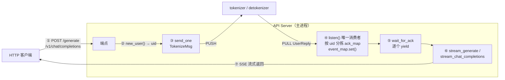
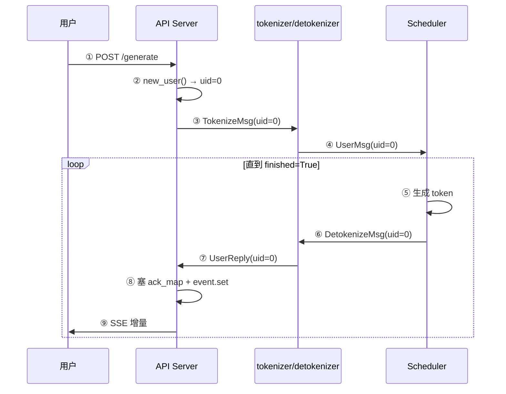
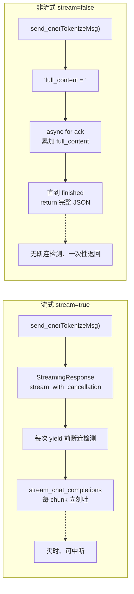
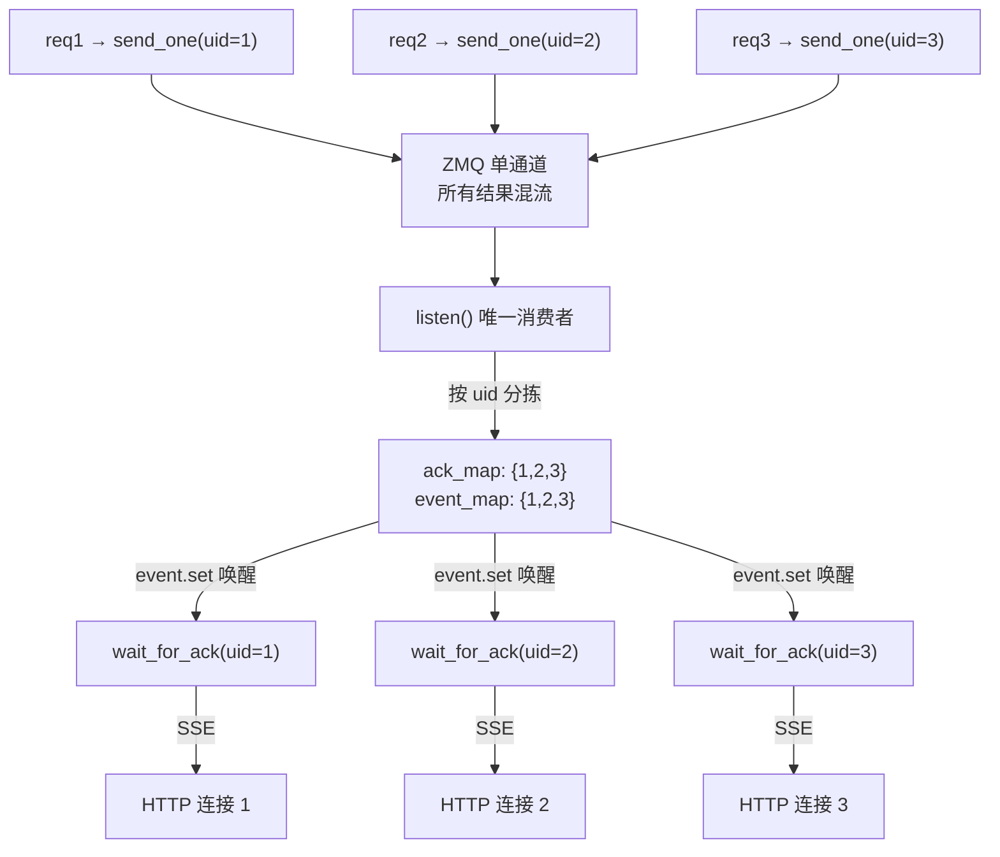

# Step 4：FrontendManager 

> 对应 [LEARNING_ROADMAP.md](LEARNING_ROADMAP.md) 的 Step 4。
> 核心文件：[server/api_server.py](python/minisgl/server/api_server.py)。
>
> 这一 Step 回答：**HTTP 请求进来后，FastAPI 是怎么把它变成 `TokenizeMsg` 发出去、又是怎么把生成结果流式吐回给用户的？**

---

## 一、这个 Step 要解决什么

API Server 是整个系统的「门面」，跑在主进程里，用 `asyncio` + FastAPI + 异步 ZMQ（`ZmqAsyncPushQueue` / `ZmqAsyncPullQueue`，见 Step 3）。它要做两件异步的事：

1. **去路**：收 HTTP 请求 → 分配 `uid` → 发 `TokenizeMsg`。
2. **回路**：收 `UserReply` → 按 `uid` 分发给等待中的 HTTP 连接 → 流式返回。

难点在于：HTTP 是「一请求一协程」，而 `UserReply` 从**一个** ZMQ 通道流进来、混着所有请求的结果。本 Step 的核心就是 `FrontendManager` 如何用 `uid + asyncio.Event` 把混流重新拆回各自的连接。

---

## 二、核心逻辑

### 2.0 全局往返总览

一张图看清「去路 + 回路」的完整链路：



### 2.1 `FrontendManager`：前端的总管家

定义在 [api_server.py:105-219](python/minisgl/server/api_server.py#L105-L219)。它持有两个异步 ZMQ 队列和两张按 `uid` 索引的表：

```python
@dataclass
class FrontendManager:
    config: ServerArgs
    send_tokenizer: ZmqAsyncPushQueue[BaseTokenizerMsg]   # 去 tokenizer（PUSH）
    recv_tokenizer: ZmqAsyncPullQueue[BaseFrontendMsg]    # 从 detokenizer（PULL）
    uid_counter: int = 0
    initialized: bool = False
    ack_map: Dict[int, List[UserReply]] = field(default_factory=dict)   # uid → 攒到的回复
    event_map: Dict[int, asyncio.Event] = field(default_factory=dict)   # uid → 唤醒事件
```

| 方法 | 作用 |
|---|---|
| `new_user()` | 分配自增 `uid`，初始化 `ack_map[uid]=[]` 和 `event_map[uid]=asyncio.Event()`，返回 `uid` |
| `listen()` | 后台死循环，唯一从 `recv_tokenizer` 拉消息的地方；按 `uid` 塞进 `ack_map` 并 `event.set()` |
| `_create_listener_once()` | 用 `initialized` 标志保证 `listen()` 只被 `create_task` 一次 |
| `send_one(msg)` | 先 `_create_listener_once()`，再 `await send_tokenizer.put(msg)` |
| `wait_for_ack(uid)` | async 生成器，等 `event` → 逐个 `yield` 攒到的回复，直到 `finished=True` |
| `stream_generate(uid)` | 纯文本 SSE 流（`/generate`、shell 用） |
| `stream_chat_completions(uid)` | OpenAI 兼容 JSON chunk SSE 流 |
| `stream_with_cancellation(gen, request, uid)` | 包一层「断连检测」，客户端断开就触发 abort |
| `abort_user(uid)` | 清理状态并下发 `AbortMsg` |
| `shutdown()` | 关闭两个 ZMQ 队列 |

**全局单例**：`_GLOBAL_STATE` 是模块级变量，`get_global_state()` 返回它。FastAPI 的端点都是模块级函数，通过 `get_global_state()` 拿到 manager，而不是靠依赖注入。

### 2.2 去路：HTTP → `TokenizeMsg`

三个端点，都是「分配 uid → 构造 `TokenizeMsg` → `send_one`」的套路。

**`POST /generate`**（[api_server.py:234-253](python/minisgl/server/api_server.py#L234-L253)）

```python
uid = state.new_user()
await state.send_one(TokenizeMsg(
    uid=uid,
    text=req.prompt,                       # 纯字符串
    sampling_params=SamplingParams(ignore_eos=req.ignore_eos, max_tokens=req.max_tokens),
))
return StreamingResponse(state.stream_with_cancellation(state.stream_generate(uid), request, uid),
                         media_type="text/event-stream")
```

**`POST /v1/chat/completions`**（[api_server.py:261-316](python/minisgl/server/api_server.py#L261-L316)）

- 有 `messages` → `prompt = [msg.model_dump() for msg in req.messages]`（`List[Dict[str,str]]`）；否则用 `req.prompt`（`str`）。
- `TokenizeMsg.text` 的类型正是 `str | List[Dict[str, str]]`——`text` 是列表时，tokenizer 端会走 `apply_chat_template`（见 Step 5）。
- sampling 参数（`temperature/top_k/top_p/ignore_eos/max_tokens`）比 `/generate` 完整，其余参数（`n`、`stop`、`presence_penalty` 等）目前是**收下了但没用**（代码里有 `# TODO: support more sampling parameters`）。
- 根据 `req.stream` 分两条路：流式走 `stream_chat_completions`，非流式走「先攒后发」（见 2.4）。

**`GET /v1/models`**（[api_server.py:319-322](python/minisgl/server/api_server.py#L319-L322)）：返回 `ModelList`，`id`/`root` 都填 `config.model_path`。另有 `GET/POST /v1` 返回 `{"status": "ok"}` 做健康检查。

### 2.3 回路：`UserReply` → 流式返回

**`listen()` 是唯一的 ZMQ 消费者**（[api_server.py:122-129](python/minisgl/server/api_server.py#L122-L129)）：

```python
async def listen(self):
    while True:
        msg = await self.recv_tokenizer.get()
        for msg in _unwrap_msg(msg):          # BatchFrontendMsg → 拆成单条
            if msg.uid not in self.ack_map:   # 已中止/已完成的 uid 直接丢
                continue
            self.ack_map[msg.uid].append(msg)
            self.event_map[msg.uid].set()     # 唤醒等这条的协程
```

`_unwrap_msg`（[api_server.py:42-50](python/minisgl/server/api_server.py#L42-L50)）把 `BatchFrontendMsg` 拆成 `UserReply` 列表，单条则原样返回。

**`wait_for_ack(uid)` 是每个请求协程的消费端**（[api_server.py:140-156](python/minisgl/server/api_server.py#L140-L156)）：

```python
async def wait_for_ack(self, uid: int):
    event = self.event_map[uid]
    while True:
        await event.wait()      # 等「有你一条新回复」
        event.clear()           # 立刻清掉，否则下次 wait() 瞬间通过
        pending = self.ack_map[uid]
        self.ack_map[uid] = []  # 取走攒到的回复
        ack = None
        for ack in pending:
            yield ack
        if ack and ack.finished:  # 收到 finished 就收工
            break
    del self.ack_map[uid]; del self.event_map[uid]   # 收尾清理
```

> 注意 `ack = None` 这行的作用：`pending` 为空时（极端情况下 `event` 被 set 但没实际攒到消息），`ack` 会残留上一轮的值；先置 `None` 作为哨兵，保证 `if ack and ack.finished` 不会误判。

**单请求完整时序**（把 2.2 去路 + 2.3 回路串起来）：



### 2.4 两种流式格式

**`stream_generate`（纯文本 SSE）**，给 `/generate` 和 shell 用（[api_server.py:158-164](python/minisgl/server/api_server.py#L158-L164)）：

```python
async for ack in self.wait_for_ack(uid):
    yield f"data: {ack.incremental_output}\n".encode()
    if ack.finished:
        break
yield "data: [DONE]\n".encode()
```

**`stream_chat_completions`（OpenAI JSON chunk）**（[api_server.py:166-194](python/minisgl/server/api_server.py#L166-L194)）：

```python
first_chunk = True
async for ack in self.wait_for_ack(uid):
    delta = {}
    if first_chunk:
        delta["role"] = "assistant"; first_chunk = False   # 第一个 chunk 只带 role
    if ack.incremental_output:
        delta["content"] = ack.incremental_output
    chunk = {"id": f"cmpl-{uid}", "object": "text_completion.chunk",
             "choices": [{"delta": delta, "index": 0, "finish_reason": None}]}
    yield f"data: {json.dumps(chunk)}\n\n".encode()
    if ack.finished:
        break

# 收尾：finish_reason="stop" 的空 delta chunk + [DONE]
end_chunk = {"id": f"cmpl-{uid}", "object": "text_completion.chunk",
             "choices": [{"delta": {}, "index": 0, "finish_reason": "stop"}]}
yield f"data: {json.dumps(end_chunk)}\n\n".encode()
yield b"data: [DONE]\n\n"
```

**两者的差别**：
- `stream_generate` 直接吐 `incremental_output` 原文，`data:` 行用单个 `\n` 结尾；`stream_chat_completions` 吐 JSON、用标准 SSE 的 `\n\n` 分隔。
- `stream_chat_completions` 把 `role` 放在**第一个** chunk 的 `delta` 里，`content` 从第二个 chunk 才开始，这是 OpenAI 流式的约定。
- 两者最终都以 `data: [DONE]` 收尾，客户端据此判断流结束。

### 2.5 非流式 `stream=false`：先攒后发

[api_server.py:292-316](python/minisgl/server/api_server.py#L292-L316)：

```python
full_content = ""
async for ack in state.wait_for_ack(uid):
    full_content += ack.incremental_output
    if ack.finished:
        break
return {"id": f"chatcmpl-{uid}", "object": "chat.completion", ...,
        "choices": [{"index": 0, "message": {"role": "assistant", "content": full_content},
                     "finish_reason": "stop"}],
        "usage": {"prompt_tokens": 0, "completion_tokens": 0, "total_tokens": 0}}
```

- **不包 `stream_with_cancellation`**，直接 `async for` 把整个 `wait_for_ack` 跑完——所以非流式路径没有断连检测（客户端跑了，后端也不知道，会继续算完）。
- `usage` 三个字段硬编码为 0，是占位符（真实 token 计数没做）。
- 用户在生成**全部结束**后才拿到结果，没有中间过程。

**流式 vs 非流式对比**：



### 2.6 客户端断开 → abort

`stream_with_cancellation`（[api_server.py:196-206](python/minisgl/server/api_server.py#L196-L206)）包在流式生成器外面：

```python
async def stream_with_cancellation(self, generator, request, uid):
    try:
        async for chunk in generator:
            if await request.is_disconnected():   # 每次 yield 前查断连
                raise asyncio.CancelledError
            yield chunk
    except asyncio.CancelledError:
        asyncio.create_task(self.abort_user(uid))  # 后台异步中止，不阻塞
        raise
```

`abort_user`（[api_server.py:208-215](python/minisgl/server/api_server.py#L208-L215)）：

```python
async def abort_user(self, uid: int):
    await asyncio.sleep(0.1)                 # 给在途 UserReply 落地的时间
    if uid in self.ack_map: del self.ack_map[uid]
    if uid in self.event_map: del self.event_map[uid]
    await self.send_one(AbortMsg(uid=uid))   # 下发中止，让后端停止计算
```

### 2.7 生命周期与启动

**`lifespan`**（[api_server.py:222-228](python/minisgl/server/api_server.py#L222-L228)）是 FastAPI 的 `@asynccontextmanager`，应用退出时调 `_GLOBAL_STATE.shutdown()` 关闭 ZMQ 队列。

**`run_api_server`**（[api_server.py:422-465](python/minisgl/server/api_server.py#L422-L465)）做三件事：

1. `assert _GLOBAL_STATE is None` 后创建 `FrontendManager`（绑 `recv_tokenizer` 到 `frontend_addr`、`send_tokenizer` 到 `tokenizer_addr`，见 Step 3 的接线表）。
2. 调 `start_backend()`（回调，spawn 所有子进程）。
3. `uvicorn.run(app, ...)` 进入 HTTP 服务；`run_shell=True` 则 `asyncio.run(shell())`。

**shell 模式**（[api_server.py:357-414](python/minisgl/server/api_server.py#L357-L414)）是 `--shell-mode` 下的交互式终端：`PromptSession` 读命令 → 拼历史消息 → 走 `shell_completion` → 直接消费 SSE `body_iterator` 打印增量。退出时 `get_global_state().shutdown()` 后用 `psutil` 杀掉所有子进程。

---

## 三、难点解析

### 难点 1：异步 HTTP 与「按 uid 分发」的桥接

HTTP 连接是「一个请求一个协程」，而 `UserReply` 从**一个** ZMQ 通道流进来、混合了所有请求的结果。怎么把混在一起的回复，精准送回各自等待的协程？

答案是 **`uid` 作为 key 的 `ack_map` + `event_map`**：

- `listen()` 是唯一从 ZMQ 拉消息的地方，按 `uid` 把回复分到各自的 `ack_map`。
- 每个请求的协程 `wait_for_ack(uid)` 用 `asyncio.Event` 等待自己的回复，`event.set()` 就是「有你的一条回复了」的信号。

这是典型的「单一消费者 + 按 key 分发」的异步模式。`uid` 只在本进程内自增，跨进程靠消息里的 `uid` 字段对齐（tokenizer/scheduler 都原样透传 `uid`）。



### 难点 2：`event.wait()` / `event.clear()` 的竞态

```python
await event.wait()   # 等
event.clear()        # 立刻清
```

`clear()` 必须在 `wait()` 返回后**立刻**做，否则 `event` 一直处于 set 状态，下一次 `wait()` 会「瞬间通过」（空转）。反过来，如果 `set()` 发生在 `wait()` 之前（消息先到、协程还没开始等），`wait()` 会立即返回，同样没问题——这正是 `asyncio.Event` 相比 `Condition` 更省事的地方：**它不丢信号，只可能「多醒一次」**。

### 难点 3：`listen()` 为什么只 `_create_listener_once` 一次

`listen()` 是死循环后台任务，必须全局只启动一个，否则多个消费者抢同一个 ZMQ `PULL` 通道，回复会被**随机分走**（ZMQ 的 PULL 是负载均衡，谁先 `recv` 谁拿走）。所以用 `initialized` 标志保证只 `asyncio.create_task` 一次。触发点放在 `send_one` 里（发第一条消息前才启动监听），而不是 `__init__`，因为 `__init__` 时 event loop 可能还没就绪。

### 难点 4：abort 为什么要 `asyncio.sleep(0.1)`

客户端断开后，可能还有**在途的 `UserReply` 在飞**（已经 `send` 出来、但 `listen()` 还没处理）。直接删 `ack_map` 会让这些消息在 `listen()` 里因为 `msg.uid not in self.ack_map` 被静默丢弃（有防御），但更稳妥的做法是先睡 0.1 秒让在途消息「落地」并正常消费，再清理状态、发 `AbortMsg`。这是个务实的经验值，不是硬性正确性要求。

### 难点 5：为什么 `abort_user` 用 `asyncio.create_task` 而不是 `await`

`abort_user` 是在 `stream_with_cancellation` 的 `except asyncio.CancelledError` 分支里被调用的，紧接着要 `raise` 重新抛出取消异常、把生成器终止掉。如果这里 `await`，会阻塞取消流程，而且一旦 `await` 的过程中再次收到取消信号会打断 abort 本身。`create_task` 把它变成「后台任务，发完就行」，主流程立刻 `raise` 结束。

### 难点 6：非流式路径没有断连检测

流式路径用 `stream_with_cancellation` 每次 `yield` 前 `await request.is_disconnected()`；但非流式路径（`stream=false`）是 `async for ack in state.wait_for_ack(uid)` 直接跑到底，**没有断连检测**。客户端中途断开后，后端仍会算完整个生成并攒 `full_content`，只是最后写响应时才发现连接已断。这是当前实现的一个已知缺口。

---

## 四、注意事项

1. **非流式 `stream=false` 是「先攒后发」**：`full_content` 累加所有 `incremental_output`，最后一次性返回完整 JSON，用户要等生成全部结束才能拿到结果。
2. **`stream_with_cancellation` 里的 `raise asyncio.CancelledError` 是刻意的**：用异常来中断生成器，并触发 abort 清理。
3. **shell 模式不走 uvicorn**：`run_api_server` 里 `if run_shell: asyncio.run(shell())`，直接在内嵌协程里跑交互，且 shell 结束时会用 `psutil` 杀掉所有子进程。
4. **`uid_counter` 从 0 单调递增**，不回收，所以 `uid` 在整个进程生命周期内唯一。
5. **`--dummy-weight` 时 shell 模式会 assert**：`assert not config.use_dummy_weight`。
6. **`TokenizeMsg.text` 有两种形态**：`str`（`/generate` 或纯 prompt）或 `List[Dict[str,str]]`（`messages` 的 `model_dump()`）。后者 tokenizer 端走 `apply_chat_template`。
7. **`usage` 三个字段是硬编码 0**，不要当成真实 token 统计。
8. **OpenAI 参数收了但没全用**：`n`、`stop`、`presence_penalty`、`frequency_penalty` 目前只进不进（未映射到采样逻辑）。

---

## 五、如何使用（API 速查）

默认 `127.0.0.1:1919`（`--host` / `--port` 可改）。

**1. 简单文本生成（SSE 流）**

```bash
curl -N http://127.0.0.1:1919/generate \
  -H "Content-Type: application/json" \
  -d '{"prompt": "Once upon a time", "max_tokens": 32, "ignore_eos": false}'
```

返回 `text/event-stream`，每行 `data: <增量文本>`，结尾 `data: [DONE]`。

**2. OpenAI 兼容流式**

```bash
curl -N http://127.0.0.1:1919/v1/chat/completions \
  -H "Content-Type: application/json" \
  -d '{
    "model": "test",
    "messages": [{"role": "user", "content": "Hello!"}],
    "max_tokens": 32,
    "temperature": 0.7,
    "stream": true
  }'
```

返回 `data: {"id":"cmpl-0", ..., "choices":[{"delta":{"role":"assistant"}, ...}]}` 等 JSON chunk，最后 `data: [DONE]`。

**3. OpenAI 兼容非流式**

```bash
curl http://127.0.0.1:1919/v1/chat/completions \
  -H "Content-Type: application/json" \
  -d '{
    "model": "test",
    "messages": [{"role": "user", "content": "Hello!"}],
    "stream": false
  }'
```

返回单个 `application/json`（`object: "chat.completion"`）。

**4. 模型列表 / 健康检查**

```bash
curl http://127.0.0.1:1919/v1/models
curl http://127.0.0.1:1919/v1
```

> 注意 `/generate` 和 `/v1/chat/completions` 的 sampling 字段集不同：前者只有 `ignore_eos`/`max_tokens`；后者还支持 `temperature/top_k/top_p`。

---

## 六、反思题

1. 如果 `listen()` 被启动两次，会发生什么？`_create_listener_once` 解决了什么问题？
2. `wait_for_ack` 里 `event.clear()` 为什么必须紧跟 `event.wait()` 之后？如果删掉会怎样？
3. `stream=false` 时为什么不用 `stream_generate` 而是直接 `async for ack in wait_for_ack`？两者差别在哪？
4. `abort_user` 为什么用 `asyncio.create_task` 而不是直接 `await`？
5. `ack_map` 和 `event_map` 为什么是两个 dict 而不是合并成一个结构？
6. `stream_generate` 和 `stream_chat_completions` 分别输出什么格式？为什么 `/generate` 不用 OpenAI 格式？
7. 非流式路径为什么没有断连检测？如果要补上，应该在哪一层加？

---

## 附：本 Step 涉及文件清单

| 文件 | 职责 | 关键符号 |
|---|---|---|
| [server/api_server.py](python/minisgl/server/api_server.py) | FastAPI 前端 + 异步分发 + SSE | `FrontendManager`、`wait_for_ack`、`stream_chat_completions`、`stream_with_cancellation`、`run_api_server` |
| [server/args.py](python/minisgl/server/args.py) | 前端地址/端口配置 | `ServerArgs`、`zmq_frontend_addr`、`zmq_tokenizer_addr` |
| [message/tokenizer.py](python/minisgl/message/tokenizer.py) | 去路消息 | `TokenizeMsg`、`AbortMsg` |
| [message/frontend.py](python/minisgl/message/frontend.py) | 回路消息 | `UserReply`、`BatchFrontendMsg` |
| [env.py](python/minisgl/env.py) | shell 模式默认采样参数 | `ENV.SHELL_MAX_TOKENS` 等 |

**下一步**：进入 Step 5（Tokenize 与 Detokenize），看消息到 tokenizer 进程后，文本和 token 是怎么互相转换的（含增量解码、中文/半个词的处理）。
