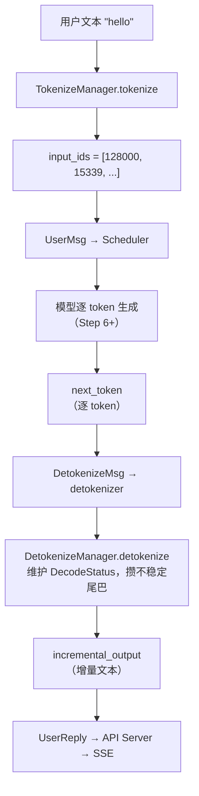
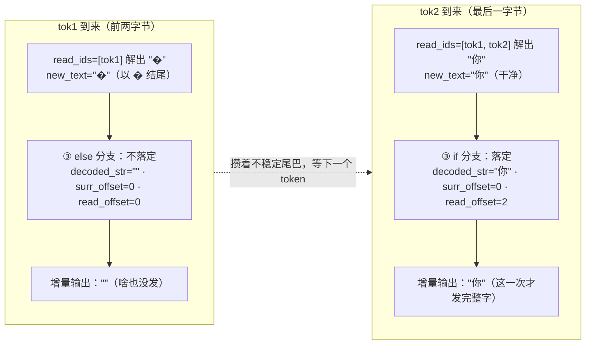
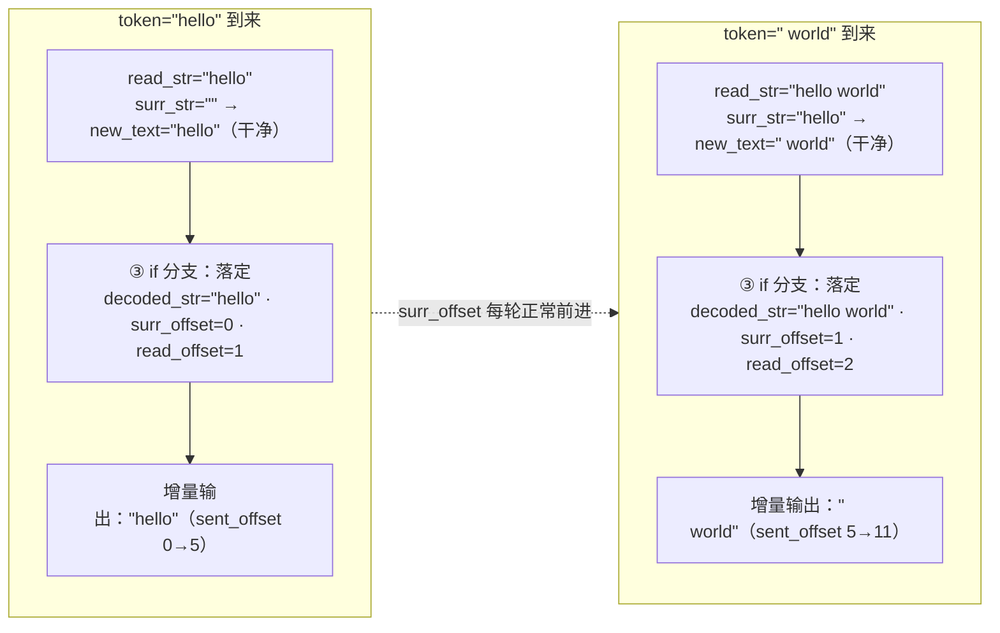
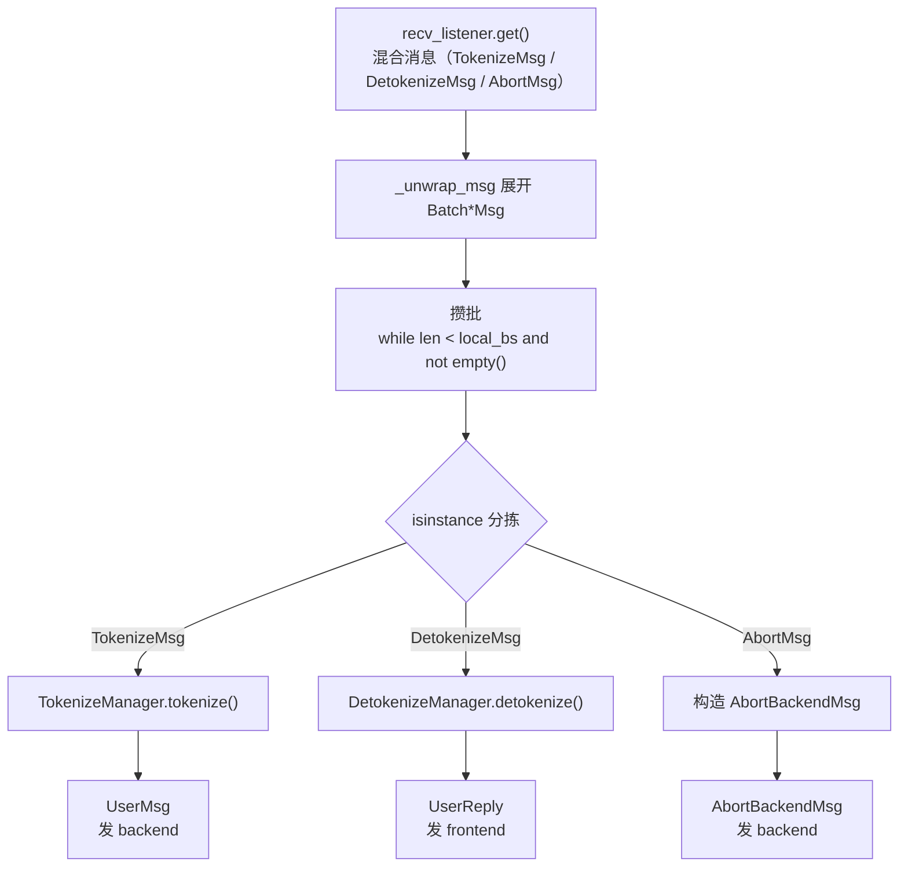

# Step 5：Tokenize 与 Detokenize（文本 ⇄ token）

> 对应 [LEARNING_ROADMAP.md](LEARNING_ROADMAP.md) 的 Step 5。
> 核心文件：[tokenizer/tokenize.py](python/minisgl/tokenizer/tokenize.py)、[tokenizer/detokenize.py](python/minisgl/tokenizer/detokenize.py)、[tokenizer/server.py](python/minisgl/tokenizer/server.py)。
>
> 这一 Step 回答：**用户打的字是怎么变成数字（token）的，模型吐出的数字又是怎么流式变回字的？**

---

## 一、这个 Step 要解决什么

tokenizer/detokenizer 进程是「文本世界」和「数字世界」的翻译官。它同时干两件事：

- **Tokenize**：`TokenizeMsg`（文本）→ `UserMsg`（`input_ids`）。
- **Detokenize**：`DetokenizeMsg`（一个 token）→ `UserReply`（一段增量文本）。

Tokenize 很简单；难点几乎全在 detokenize 的「流式增量解码」上——因为 **token 边界不等于字符边界**，一个新 token 可能把上一个 token 解码出的「末尾半个字」改写掉。

整条链路一眼看全：



---

## 二、核心逻辑

### 2.1 Tokenize（相对简单）

[tokenize.py:14-31](python/minisgl/tokenizer/tokenize.py#L14-L31) 的 `TokenizeManager.tokenize`：

```python
def tokenize(self, msgs: List[TokenizeMsg]) -> List[torch.Tensor]:
    results = []
    for msg in msgs:                          # TODO: batch tokenization，目前逐条
        if isinstance(msg.text, list):        # 是 messages 列表（chat 模式）
            prompt = self.tokenizer.apply_chat_template(
                msg.text, tokenize=False, add_generation_prompt=True)
            assert isinstance(prompt, str)
        else:                                 # 是纯字符串
            prompt = msg.text
        input_ids = self.tokenizer.encode(prompt, return_tensors="pt")
        results.append(input_ids.view(-1).to(torch.int32))
    return results
```

要点：

- `text` 是 `list`（`[{role, content}, ...]`）时，`apply_chat_template` 把它拼成带特殊 token（如 `<|im_start|>`、`<|endoftext|>`）的 prompt 字符串。`add_generation_prompt=True` 会**追加 assistant 的起始标记**，提示模型「该你开始生成了」。
- `text` 是 `str` 时直接 `encode`，不加 chat 模板。
- `encode(return_tensors="pt")` 得到形状 `[1, L]` 的张量，`view(-1)` 压成 1D，`.to(torch.int32)` 转 int32（对应 Step 3 里「Tensor 只支持 1D」的约定，也是 `UserMsg.input_ids` 要求的 dtype）。

### 2.2 tokenizer 从哪来：`load_tokenizer`

[utils/hf.py:17-27](python/minisgl/utils/hf.py#L17-L27)：

```python
def load_tokenizer(model_path: str) -> PreTrainedTokenizerBase:
    tokenizer = AutoTokenizer.from_pretrained(model_path)
    # Some Mistral models store chat_template in a separate JSON file
    if not getattr(tokenizer, "chat_template", None):
        try:
            path = hf_hub_download(repo_id=model_path, filename="chat_template.json")
            with open(path, "r", encoding="utf-8") as f:
                tokenizer.chat_template = json.load(f)["chat_template"]
        except Exception:
            pass
    return tokenizer
```

`tokenize_worker` 在启动时调用它一次（[server.py:47](python/minisgl/tokenizer/server.py#L47)），把结果同时传给 `TokenizeManager` 和 `DetokenizeManager`。

### 2.3 Detokenize 概览：`DecodeStatus` 与三个 offset

[detokenize.py:54-60](python/minisgl/tokenizer/detokenize.py#L54-L60) 为**每个 uid 维护一个状态**：

```python
@dataclass
class DecodeStatus:
    decoded_ids: List[int]   # 已累积的 token id（不含 EOS）
    decoded_str: str         # 已「落定」的文本
    read_offset: int         # 已读到的 token 总数（token 空间）
    surr_offset: int         # 已稳定的 token 数（不会因后续 token 改变，token 空间）
    sent_offset: int         # 已发给用户的字符数（字符空间）
```

三个 offset 分属两个空间：`read_offset` / `surr_offset` 数的是 **token**，`sent_offset` 数的是 **字符**。

核心思路：**新 token 可能改写已解码文本的「尾巴」**。所以不能「每来一个 token 就 decode 一次、把结果整段发出去」——那会发出一个随后被改写的半成品。正确做法是：

1. 把「稳定前缀」之外的尾巴攒着；
2. 每次新 token 到来，把「稳定点之后 + 新 token」**整体重新 decode**；
3. 只把「确定不会变」的部分发给用户。

### 2.4 detokenize 算法逐步拆解（题眼）

[detokenize.py:70-111](python/minisgl/tokenizer/detokenize.py#L70-L111) 的 `DetokenizeManager.detokenize`，去掉批量框架后核心逻辑如下：

```python
# ① 每个 uid 维护状态；EOS 且 finished 时不算进去
if msg.uid not in self.decode_map:
    self.decode_map[msg.uid] = DecodeStatus(decoded_ids=[], decoded_str="", read_offset=0, surr_offset=0, sent_offset=0)
s = self.decode_map[msg.uid]
if not (msg.finished and msg.next_token == self.eos_token_id):
    s.decoded_ids.append(msg.next_token)

# ② 两段分别 batch_decode
read_ids = s.decoded_ids[s.surr_offset:]            # 稳定点之后的所有 id（含新 token）
surr_ids = s.decoded_ids[s.surr_offset:s.read_offset]  # 上一轮「未稳定尾巴」（不含新 token）
read_str = self.tokenizer.batch_decode(read_ids)    # 全量重解码
surr_str = self.tokenizer.batch_decode(surr_ids)    # 参照解码
new_text = read_str[len(surr_str):]                 # 切掉已发过的前缀，留下真正新增的字符

# ③ 分两种情况提交
if len(new_text) > 0 and not new_text.endswith("�"):
    # 干净：整段落定，advance 两个 offset
    output_str = s.decoded_str + new_text
    s.decoded_str = output_str
    s.surr_offset = s.read_offset
    s.read_offset = len(s.decoded_ids)
else:
    # 空 或 结尾是替换字符 �：不能整段落定，用 find_printable_text 只发安全前缀
    new_text = find_printable_text(new_text)
    output_str = s.decoded_str + new_text

# ④ 按 sent_offset 切片出增量
incremental_output = output_str[s.sent_offset:]
s.sent_offset = len(output_str)
if msg.finished:
    del self.decode_map[msg.uid]
```

**逐行解读：**

- **① 维护 `decoded_ids`**：新 token 追加到累积列表。EOS 是个例外——`msg.finished` 且 `next_token == eos_token_id` 时不追加，避免把结束符 decode 成奇怪字符（见 [注意事项](#四注意事项)）。

- **② 两段 `batch_decode`**：这是理解整套算法的关键。
  - `read_ids = decoded_ids[surr_offset:]`：从稳定点开始，**带上新 token 一起**重新解码，得到「最新完整文本」。
  - `surr_ids = decoded_ids[surr_offset:read_offset]`：从稳定点到**上一轮读到的末尾**（不含新 token），单独解码，作为「上一轮的尾巴文本」参照。
  - `new_text = read_str[len(surr_str):]`：用参照文本的长度把重解码结果里「之前已经处理过的部分」切掉，剩下的就是新 token 真正引入的字符。为什么要按「参照文本的长度」切，而不是按「上一轮 read_str」切？因为上一轮的尾巴可能已经被新 token 改写，长度对不上了；单独 decode 一次 `surr_ids` 拿到的 `surr_str` 才是可靠的锚点。

- **③ 两种提交方式**（这是 `�` 处理的核心）：
  - **`new_text` 非空且不以 `�` 结尾**：说明新 token 引入的字符是「完整的」（没有半个 UTF-8 字符），整段落定：写进 `decoded_str`，并把 `surr_offset` 推进到上一轮 `read_offset`（即「稳定点之前都算稳了」），`read_offset` 推进到当前总长。
  - **`new_text` 为空或以 `�` 结尾**：说明 token 边界切在了多字节字符中间（UTF-8 编码的半个字 decode 出来就是 `�` U+FFFD）。此时**不落定**（`decoded_str`、两个 token offset 都不动），只用 `find_printable_text` 把 `new_text` 里**已经安全的那部分前缀**发出去。下一轮这个「半截」会被和新 token 一起重新 decode，凑成完整字符。

- **④ 用 `sent_offset` 切片**：`output_str` 是「落定文本 + 本次可发前缀」，减掉已经发过的 `sent_offset` 个字符，就得到本次的增量。发完更新 `sent_offset`。

### 2.5 `find_printable_text`：四种「安全边界」

[detokenize.py:35-51](python/minisgl/tokenizer/detokenize.py#L35-L51)（借用自 HuggingFace `transformers/generation/streamers.py`）：

```python
def find_printable_text(text: str):
    if text.endswith("\n"):
        return text                                   # ① 换行 → 整段安全
    elif len(text) > 0 and _is_chinese_char(ord(text[-1])):
        return text                                   # ② 结尾是 CJK → 整段安全
    elif len(text) > 1 and _is_chinese_char(ord(text[-2])):
        return text[:-1]                              # ③ 倒数第二是 CJK → 发到倒数第一之前
    else:
        return text[: text.rfind(" ") + 1]            # ④ 否则发到最后一个空格为止
```

四种边界对应四种「确定不会变」的情况：

1. **结尾换行**：换行是天然词边界，整段都稳定，全发。
2. **结尾是 CJK 字符**：中文（及 CJK 统一表意文字）每个字是自成一体的，不存在英文那种「半个词」的中间态，全发。
3. **倒数第二个字符是 CJK**：说明最后一个字符很可能是「半个」东西（比如紧跟的半截字节或组合符号），把它扣下，只发前面的完整 CJK 部分。
4. **否则（英文等空格分词语言）**：只发到**最后一个空格**为止，把空格之后那个可能不完整的单词尾巴扣下。

`_is_chinese_char`（[detokenize.py:10-32](python/minisgl/tokenizer/detokenize.py#L10-L32)）就是判断码点是否落在 CJK 的几个 Unicode 区块（CJK 统一表意文字 + 扩展 A~G + 兼容表意文字），不包含日文假名和韩文谚文（那些是空格分词的，按英文一样处理）。

### 2.6 完整示例：offset 如何演进

上面 2.4 + 2.5 讲了「什么时候落定、什么时候只发安全前缀」。这里用两个完整例子把 offset 的走动看一遍。

**例 A：中文「你」被 byte-level tokenizer 拆成两个 token**

假设 tokenizer 把「你」（UTF-8 三字节）拆成 `tok1`（前两字节）+ `tok2`（最后一字节）：



**结论**：`tok1` 那轮一个字都没发出去（半个字节 decode 成 `�`，走 `else` 分支被扣下），直到 `tok2` 凑齐整个「你」才一次性发出。这就是「攒着不稳定尾巴」的意义。

**例 B：英文单词 + 空格，`surr_offset` 正常前进**

假设 `"hello world"` 分成 `"hello"` + `" world"`（第二个 token 自带前导空格）：



对比例 A：英文 token 解码出来就是干净文本，所以 `surr_offset` 每轮正常前进，稳定边界不断向右推进。

### 2.7 tokenizer/detokenizer 进程主循环

[server.py:31-110](python/minisgl/tokenizer/server.py#L31-L110) 的 `tokenize_worker`：

```python
send_backend  = ZmqPushQueue(backend_addr,  create=False, encoder=BaseBackendMsg.encoder)
send_frontend = ZmqPushQueue(frontend_addr, create=False, encoder=BaseFrontendMsg.encoder)
recv_listener = ZmqPullQueue(addr, create=create, decoder=BatchTokenizerMsg.decoder)
...
while True:
    pending_msg = _unwrap_msg(recv_listener.get())
    while len(pending_msg) < local_bs and not recv_listener.empty():
        pending_msg.extend(_unwrap_msg(recv_listener.get()))   # 攒批到 local_bs

    detokenize_msg = [m for m in pending_msg if isinstance(m, DetokenizeMsg)]
    tokenize_msg   = [m for m in pending_msg if isinstance(m, TokenizeMsg)]
    abort_msg      = [m for m in pending_msg if isinstance(m, AbortMsg)]
    assert len(detokenize_msg)+len(tokenize_msg)+len(abort_msg) == len(pending_msg)

    if detokenize_msg:
        replies = detokenize_manager.detokenize(detokenize_msg)
        # 拼成 UserReply → send_frontend.put(...)
    if tokenize_msg:
        tensors = tokenize_manager.tokenize(tokenize_msg)
        # 拼成 UserMsg → send_backend.put(...)
    if abort_msg:
        # 拼成 AbortBackendMsg → send_backend.put(...)
```

一个进程同时 pull 三类消息，用 `isinstance` 分拣后各走各的处理，再各自 `put` 到不同下游。注意 `detokenize` / `tokenize` 都是**整批处理**的（`detokenize` 内部用一次 `batch_decode` 处理整批消息），这也是攒批的意义所在。



---

## 三、难点解析

### 难点 1：`DecodeStatus` 的三个 offset 到底在管什么？

这是整个 Step 的题眼。逐字段理解（结合 2.4 的算法与 2.6 的两个示例）：

- `read_offset`（token 空间）：已经「读过」多少个 token 用于解码，等于 `len(decoded_ids)` 在上一轮的值。
- `surr_offset`（token 空间）：其中多少个 token 是「稳定」的——即 `decoded_ids[:surr_offset]` 的解码结果不会因为后续 token 而改变。
- `sent_offset`（字符空间）：已经「发给用户」多少个字符，用于从 `output_str` 里切出增量。

`read_ids = decoded_ids[surr_offset:]` 拿「从上次稳定点之后的所有 id」去解码；`surr_ids = decoded_ids[surr_offset:read_offset]` 拿「上一轮已解码但未稳定的部分」，用来对齐新解码结果（因为新 token 可能改变前一个词的拼写）。

### 难点 2：为什么要分 `read_ids` 和 `surr_ids` 两段去 `batch_decode`？

tokenizer 的 `decode` 是「无状态」的，每次给你一段 token 从头解码。但流式场景里，上一段 token 的「尾巴」可能因为新 token 的加入而改变。所以：

- 把「稳定部分之后 + 新 token」一起解码（`read_ids`），得到最新文本；
- 再单独解码「稳定部分之后、但不含新 token」的部分（`surr_ids`）作为参照；
- `new_text = read_str[len(surr_str):]` 用「参照文本的长度」把新解码结果里「之前已经处理过」的部分切掉，只留下真正新增的字符。

### 难点 3：一个进程怎么同时干 tokenize 和 detokenize 两件事？

关键在 `tokenize_worker` 的 `recv_listener` 收到的是**混合消息流**（Step 0/3 里讲过：默认共享模式下 `minisgl_1` 一个地址同时收 `TokenizeMsg` 和 `DetokenizeMsg`）。于是主循环用 `isinstance` 把一批消息分成三组，分别交给 `TokenizeManager` / `DetokenizeManager` 处理，再分别 `put` 到不同的下游队列（`send_backend` / `send_frontend`）。

### 难点 4：`local_bs` 攒批的意义

主循环 `while len(pending_msg) < local_bs and not empty()` 会尽量攒到 `local_bs` 条再一起处理，减少 `batch_decode` 的调用次数、提高吞吐。默认 `local_bs=1`（不攒批），是个可调的性能旋钮。代价是攒批会引入一点延迟（等批满才处理）。

### 难点 5：`�`（U+FFFD 替换字符）是「半个字」的信号

当 token 边界切在多字节 UTF-8 字符中间时（比如一个 emoji 或中文被拆成两个 token），单独 decode 那「半个」字节会得到 `�`（Unicode 替换字符）。代码用 `new_text.endswith("�")` 检测这种状态：一旦出现，说明尾巴不完整，**不落定**，等下一个 token 到来一起重新 decode 成完整字符。这是 2.4 第 ③ 步 `else` 分支存在的全部理由。

### 难点 6：为什么「干净」时要把 `surr_offset` 推进，而不是只改 `read_offset`？

`surr_offset` 标记的是「稳定边界」。只有在 `new_text` 干净（不以 `�` 结尾）时，才说明新 token 没有改写之前的尾巴，于是可以把稳定边界推进到「上一轮读到的地方」。反之（`�` 分支）**两个 token offset 都不动**，让这段不稳定的尾巴保留在 `decoded_ids[surr_offset:]` 里，下一轮继续参与重解码。

---

## 四、注意事项

1. **EOS token 不加入解码**：`if not (msg.finished and msg.next_token == eos_token_id): s.decoded_ids.append(...)`，避免把结束符也 decode 成奇怪字符。
2. **`find_printable_text` 处理 `�`**：解码出 `�`（UTF-8 多字节字符的中间态）时，这一小段要等下一个 token 再一起解码。
3. **`apply_chat_template` 只在 `text` 是 list 时用**：纯字符串 prompt 直接 encode，不加 chat 模板。
4. **每条消息 `finished` 时删掉 `decode_map[uid]`**，避免状态泄漏（同一 uid 的后续消息会重新初始化状态）。
5. **`detokenize` 是批量、无副作用的批量重解码**：它内部用一次 `batch_decode` 处理整批，但每个 uid 的状态是独立维护的。
6. **`TokenizeMsg` 里 `add_generation_prompt=True`**：这决定聊天模板会补上 assistant 起始标记，漏了会导致模型不知道「该开始回复了」。

---

## 五、如何使用（直接调用 manager）

`TokenizeManager` / `DetokenizeManager` 是纯 Python 类，不依赖 ZMQ，可以直接实例化使用：

```python
from minisgl.message import TokenizeMsg, DetokenizeMsg
from minisgl.core import SamplingParams
from minisgl.utils import load_tokenizer
from minisgl.tokenizer.tokenize import TokenizeManager
from minisgl.tokenizer.detokenize import DetokenizeManager

tok = load_tokenizer("meta-llama/Llama-3.1-8B")
tm = TokenizeManager(tok)
dm = DetokenizeManager(tok)

# Tokenize：文本 → input_ids
ids = tm.tokenize([TokenizeMsg(uid=0, text="hello", sampling_params=SamplingParams())])
# → [tensor([128000, 15339, ...], dtype=torch.int32)]  形状 1D

# Detokenize：逐 token 喂进来，拿增量文本
for tok_id in ids[0].tolist():
    out = dm.detokenize([DetokenizeMsg(uid=0, next_token=tok_id, finished=False)])
    print(repr(out[0]))   # 每个 token 的增量，可能为空串（半个词被扣下）
# 结束时传 finished=True，让 dm 清理 uid 状态
out = dm.detokenize([DetokenizeMsg(uid=0, next_token=tok.eos_token_id, finished=True)])
```

> 注意 `DetokenizeManager` 按 `uid` 维护状态，所以同一个 uid 要按顺序喂 token；不同 uid 互不干扰，可并行交错。

---

## 六、反思题

1. 为什么不能「每个 token 独立 decode 再拼接」？用一个英文单词被拆成多个 token、或一个 emoji 被拆成多个字节的例子说明。
2. `surr_offset` 和 `read_offset` 的差代表什么？为什么要把这段单独 `batch_decode` 一次？
3. `find_printable_text` 里，中文为什么可以「整段都发」，而英文要「发到最后一个空格」？
4. 如果 `tokenize_worker` 里忘了用 `isinstance` 分拣，直接把所有消息当 `DetokenizeMsg` 处理，会发生什么？
5. `local_bs` 调大有什么收益和代价？
6. `new_text.endswith("�")` 检测的是什么问题？如果去掉这个判断，会发生什么？

---

## 附：本 Step 涉及文件清单

| 文件 | 职责 | 关键符号 |
|---|---|---|
| [tokenizer/tokenize.py](python/minisgl/tokenizer/tokenize.py) | 文本→token | `TokenizeManager.tokenize` |
| [tokenizer/detokenize.py](python/minisgl/tokenizer/detokenize.py) | token→增量文本 | `DetokenizeManager.detokenize`、`DecodeStatus`、`find_printable_text`、`_is_chinese_char` |
| [tokenizer/server.py](python/minisgl/tokenizer/server.py) | 进程主循环 | `tokenize_worker`、`_unwrap_msg` |
| [utils/hf.py](python/minisgl/utils/hf.py) | 加载 tokenizer | `load_tokenizer` |

**下一步**：进入 Step 6（核心数据结构 `Req`），看请求进入 Scheduler 后，它的状态是怎么被三个长度字段精确描述的。
