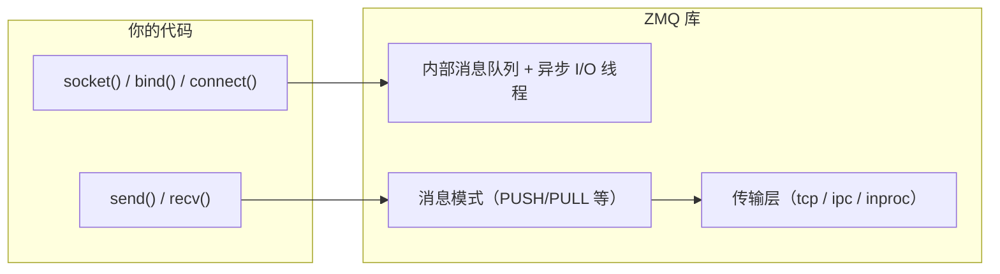
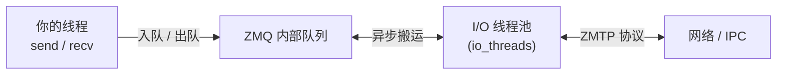
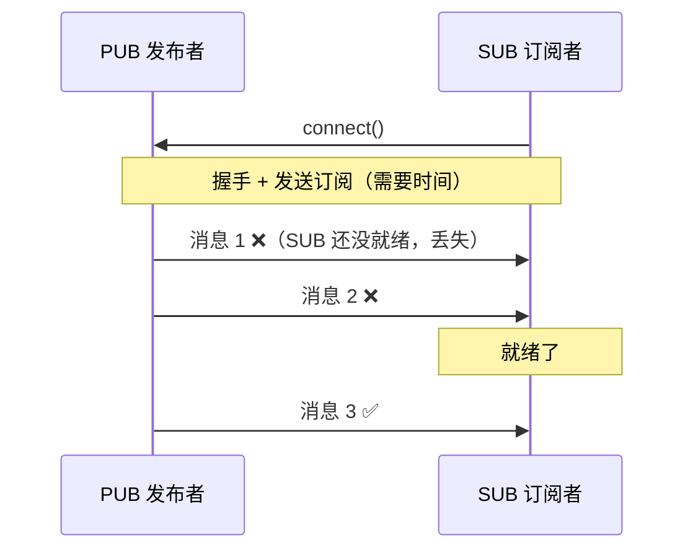
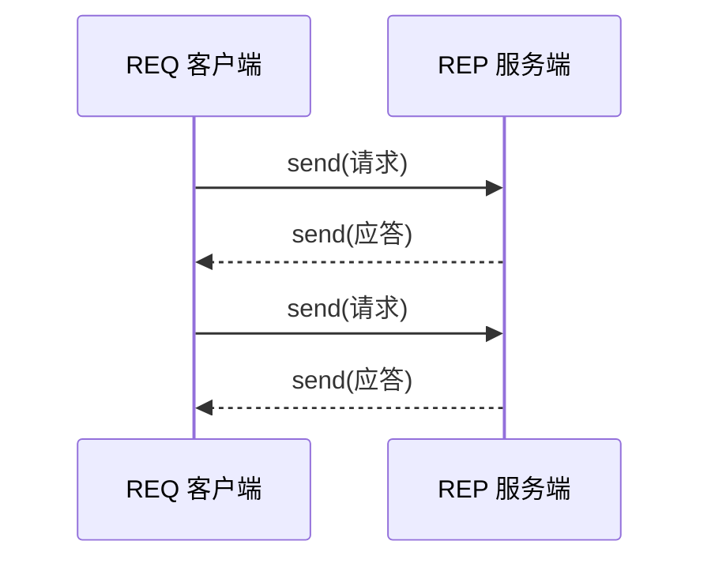
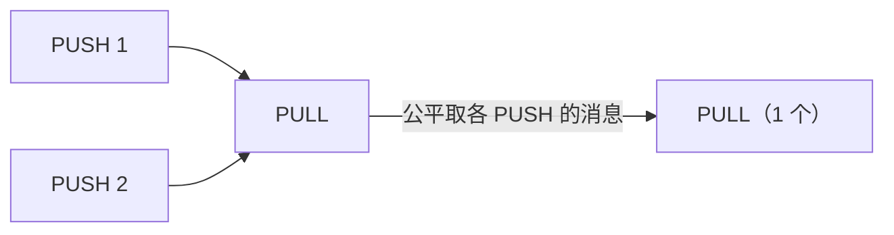
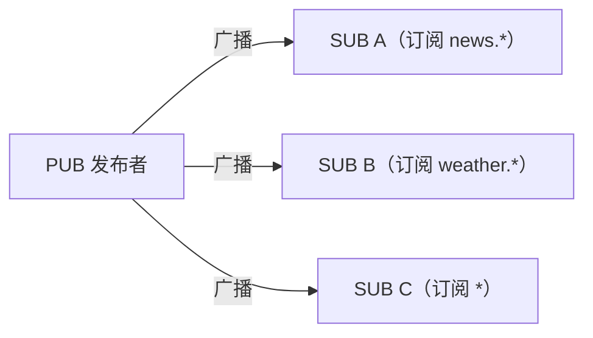
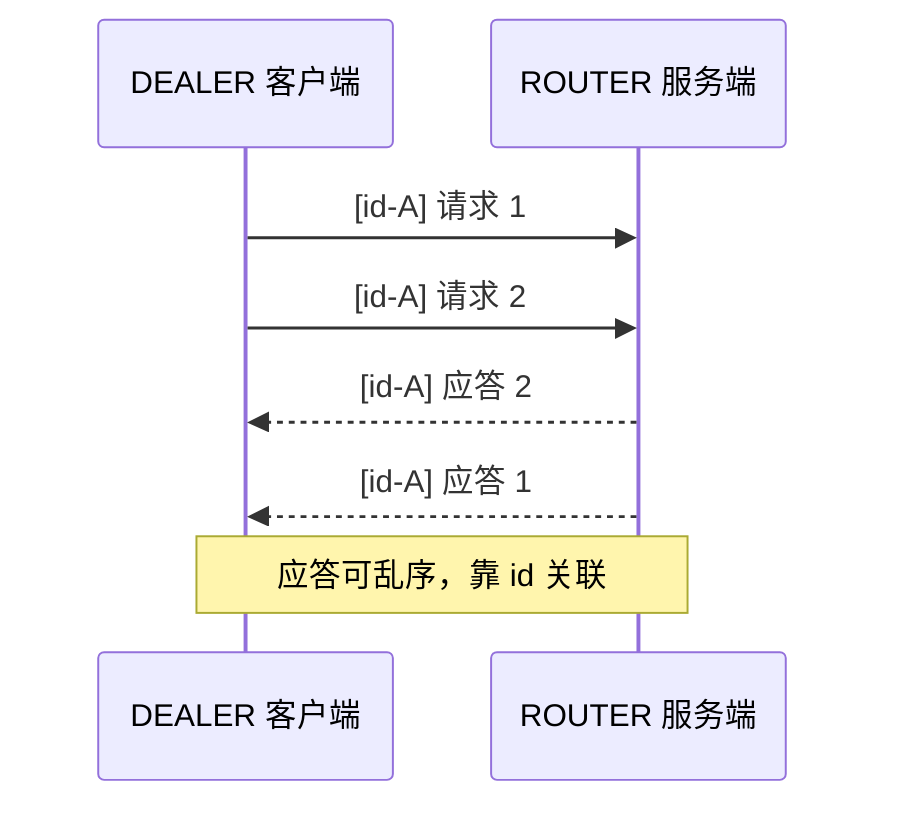
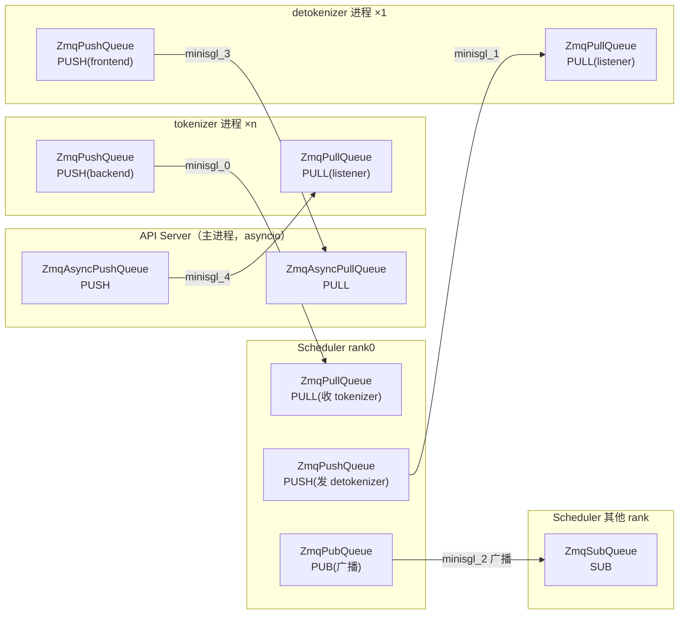
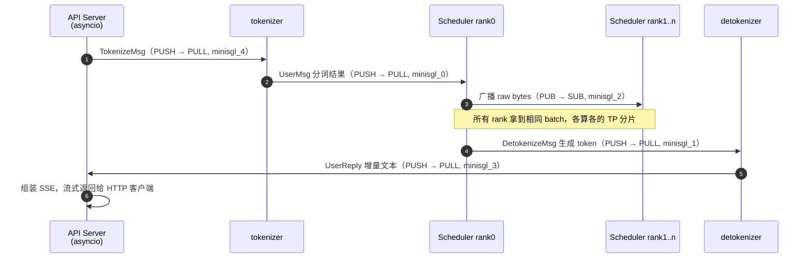
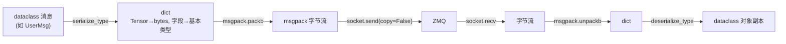

# ZMQ（ZeroMQ）详解

> 配套 mini-sglang 源码学习。本文讲清 ZMQ 的概念、底层原理、核心消息模式与使用注意事项，并对照项目里的 [mp.py](python/minisgl/utils/mp.py) 逐层拆解 API Server ↔ tokenizer ↔ Scheduler 的进程拓扑。

## 目录

1. [ZMQ 是什么：不是消息队列，是「带队列语义的 socket」](#一zmq-是什么不是消息队列是带队列语义的-socket)
2. [核心概念](#二核心概念)
3. [底层原理](#三底层原理)
4. [四种核心消息模式（图解）](#四四种核心消息模式图解)
5. [与 multiprocessing.Queue / Pipe 对比](#五与-multiprocessingqueue--pipe-对比)
6. [mini-sglang 实战：进程拓扑与消息流](#六mini-sglang-实战进程拓扑与消息流)
7. [注意事项与最佳实践](#七注意事项与最佳实践)

---

## 一、ZMQ 是什么：不是消息队列，是「带队列语义的 socket」

**ZeroMQ（简称 ZMQ / 0MQ / ØMQ）** 是一个**异步消息通信库**，不是 RabbitMQ 那样的独立消息队列服务（broker）。它的定位很独特：

- 对你暴露的是 **Socket API**（`socket()`、`bind()`、`connect()`、`send()`、`recv()`），写起来像网络编程。
- 但底层却提供 **队列语义**（缓冲、负载均衡、广播、重连），行为像消息队列。

所以官方把它叫「**concurrency framework（并发框架）**」——它把「socket」和「队列」这两件事缝在了一起，让你用极少的代码搭出可靠的进程/机器间通信拓扑。



**和传统 socket、消息队列的对比**：

| | 传统 socket | ZMQ | 消息队列（RabbitMQ 等） |
|---|---|---|---|
| **形态** | 裸字节流，自己造轮子 | 库（link 进进程） | 独立服务（broker） |
| **有无中心节点** | 无 | **无 broker** | 有 broker |
| **缓冲/重连/负载均衡** | 全要自己写 | 内置 | 内置 |
| **消息边界** | 无（TCP 字节流） | 有（每帧一条完整消息） | 有 |
| **跨语言** | 是 | 是 | 是 |
| **持久化** | 无 | 无 | 有（可落盘） |
| **适用** | 需要完全掌控底层 | 进程/机器间高性能消息拓扑 | 需要持久化、削峰、路由 |

**一句话**：ZMQ 是「**没有 broker 的消息队列语义，披着 socket 的外衣**」。mini-sglang 用它做各进程间的主通信，正是因为它够快、支持 PUSH/PULL 的负载均衡与 PUB/SUB 的广播，还不像 RabbitMQ 那样要额外部署一个服务。

---

## 二、核心概念

### 2.1 Context（上下文）

所有 ZMQ 操作都挂在一个 `Context` 上，它内部管理 **I/O 线程池**：

```python
import zmq

ctx = zmq.Context()              # 默认 io_threads=1
ctx = zmq.Context(io_threads=2)  # 指定 I/O 线程数
socket = ctx.socket(zmq.PUSH)    # 从 ctx 创建 socket
```

- `Context` 是**线程安全**的，可以跨线程共享。
- `Socket` 则**不是线程安全**的：一个 socket 只能被一个线程使用，别在两个线程里同时对同一个 socket `send`/`recv`。
- 退出时 `ctx.term()` 释放资源（mini-sglang 的 `stop()` 就是先 `socket.close()` 再 `context.term()`）。

### 2.2 Socket（不是传统 socket）

ZMQ 的 socket 和 TCP 的 socket 是两回事：

- **TCP socket 是「管道」**：一次 `send` 对应一次连接，点对点、同步。
- **ZMQ socket 是「插线板上的孔」**：一个 socket 可以 `connect` 到**多个**对端（1 对 N），或让**多个**对端 `connect` 到自己（N 对 1）。到底怎么路由，由「消息模式」决定。

它承担的工作包括：自动重连、消息队列缓冲、负载均衡、消息分帧。

### 2.3 消息模式（Messaging Patterns）

这是 ZMQ 的灵魂。ZMQ 预置了若干种「通信模式」，每种规定了 socket 的收发规则和路由语义。核心四种：

| 模式 | 方向 | 路由语义 | 场景 |
|---|---|---|---|
| **REQ / REP** | 双向 | 严格一问一答（锁步） | 同步 RPC |
| **PUSH / PULL** | 单向 | 负载均衡（轮询分发） | 任务流水线、扇出扇入 |
| **PUB / SUB** | 单向 | 广播 + 主题过滤 | 一对多发布 |
| **DEALER / ROUTER** | 双向 | 异步、多路复用、可路由 | 复杂拓扑 / 自建 broker |

（还有 `PAIR`，用于 inproc 线程间 1 对 1。）详细图解见[第四节](#四四种核心消息模式图解)。

### 2.4 传输层（Transport）

地址前缀决定走哪种传输：

| 前缀 | 含义 | 说明 |
|---|---|---|
| `tcp://host:port` | TCP 网络 | 跨机器 |
| `ipc://path` | 进程间通信 | 本机进程，比 tcp 快；Linux 是 UNIX socket，Windows 是命名管道 |
| `inproc://name` | 进程内线程间 | 最快，不经过网络栈，只能同进程 |
| `pgm://` / `epgm://` | 多播 | 一对多，需硬件/网络支持 |

mini-sglang 全部用 `ipc://`（如 [config.py](python/minisgl/scheduler/config.py) 的 `ipc:///tmp/minisgl_0`），因为所有进程都在本机。

### 2.5 端点（endpoint）：bind vs connect

```python
socket.bind("ipc:///tmp/foo")    # 我是端点创建者（服务端）
socket.connect("ipc:///tmp/foo") # 我是连接者（客户端）
```

关键差异：

- **一个地址只能被一个 socket `bind`**，但可以被多个 socket `connect`。
- ZMQ 不强制「服务端 bind、客户端 connect」——**谁 bind 谁 connect 都可以**。
- ZMQ 甚至允许**先 connect 后 bind**：connect 方会在后台自动重试，等 bind 方上线后自动连上（容错能力）。

实践中常用规则：**先启动、更稳定的一方 `bind`；后启动、动态的一方 `connect`**。mini-sglang 就是「谁先活谁 bind」——见[第六节](#六mini-sglang-实战进程拓扑与消息流)。

### 2.6 消息帧与 ZMTP

ZMQ 底层用 **ZMTP（ZeroMQ Message Transport Protocol）** 做 wire protocol：在 TCP/IPC 之上把消息**分帧**传输。所以你 `send()` 一个对象，对方 `recv()` 拿到的就是**完整的一整条消息**，不会有 TCP 那种「字节流粘连、半包」问题——ZMQ 帮你处理好了消息边界。

---

## 三、底层原理

### 3.1 异步 I/O 引擎（io_threads）

ZMQ 的 `Context` 维护一个 **I/O 线程池**。你的 `send()`/`recv()` 不直接碰 socket 底层，而是读写 ZMQ 内部的消息队列；真正的网络收发由后台 I/O 线程异步完成。



好处：**收发解耦**——你 `send` 完立刻返回，不用等对端 `recv`；对端还没起来也没关系，消息先存在队列里。

### 3.2 消息队列与 HWM（水位线）

每个 ZMQ socket 两端都有**发送队列**和**接收队列**。队列不是无限大，受 **HWM（High Water Mark，高水位）** 限制：

- 默认 HWM = **1000** 条消息。
- 发送队列满了，`send()` 会**阻塞**（或按 socket 类型丢弃），直到对端消费腾出空间。
- 接收队列满了，ZMQ 会**丢弃新消息**（旧消息还在）。

> 这是 ZMQ「能当队列用」的根源，也是它「**不持久化、满了就丢/阻塞**」的原因——它只做内存缓冲，不落盘。

### 3.3 无 broker 的解耦是怎么做到的

传统 socket 要求收发双方**同时在线、状态同步**。ZMQ 靠两样东西解耦：

1. **内部队列缓冲**：生产者写完就走，消费者晚到也能从队列拿到（在 HWM 范围内）。
2. **自动重连 + 消息模式路由**：connect 方断线了后台自动重连；PUSH/PULL 自动轮询、PUB/SUB 自动广播，你无需管理连接状态。

所以它能做到「无 broker 也能有队列般的缓冲与容错」。

### 3.4 慢连接者问题（slow joiner）

这是 ZMQ 最经典的坑，尤其 **PUB/SUB**：SUB 端 `connect` 到 PUB 端后，要经历「TCP 握手 → ZMTP 握手 → 发送订阅」几步才真正开始收消息。**在这段「预热」时间里 PUB 发出去的消息，SUB 会漏收**。



**解法**：SUB 连上后 `sleep` 一小段时间再开始发；或用 REQ/REP 先做一次「同步握手」；或用 XPUB/XSUB 手动感知订阅状态。mini-sglang 的 TP 广播在「所有 rank 先跑完 `sync_all_ranks()` 屏障」之后才开始，天然规避了这个问题。

---

## 四、四种核心消息模式（图解）

### 4.1 REQ / REP —— 严格一问一答

```python
# 服务端
rep = ctx.socket(zmq.REP); rep.bind("tcp://*:5555")
msg = rep.recv(); rep.send(b"reply")

# 客户端
req = ctx.socket(zmq.REQ); req.connect("tcp://localhost:5555")
req.send(b"hello"); reply = req.recv()
```



**核心约束：锁步（lockstep）状态机**。REQ 端必须 `send → recv → send → recv` 严格交替；REP 端必须 `recv → send → recv → send`。一旦乱序（比如 REQ 连着 `send` 两次）直接报 `Operation cannot be accomplished in current state`。

- **优点**：简单、语义清晰。
- **缺点**：**同步阻塞**，且一个 REQ 一次只能有一个「在途请求」，吞吐低。

### 4.2 PUSH / PULL —— 单向流水线 + 负载均衡

```python
# 生产者
push = ctx.socket(zmq.PUSH); push.bind("ipc:///tmp/tasks")
push.send(b"task")

# 消费者
pull = ctx.socket(zmq.PULL); pull.connect("ipc:///tmp/tasks")
task = pull.recv()
```



- **单向**：只能 PUSH → PULL，不能反向。
- **负载均衡**：
  - 多个 PUSH → 1 个 PULL：PULL **公平轮询**从各 PUSH 取消息（fan-in 汇聚）。
  - 1 个 PUSH → 多个 PULL：PUSH **轮询分发**给各 PULL（fan-out 分发）。
- **场景**：任务流水线、多生产者多消费者。mini-sglang 几乎所有数据通道都是 PUSH/PULL。

### 4.3 PUB / SUB —— 一对多广播 + 主题过滤

```python
# 发布者
pub = ctx.socket(zmq.PUB); pub.bind("tcp://*:5560")
pub.send(b"news.topic1  some data")

# 订阅者（必须设置订阅！）
sub = ctx.socket(zmq.SUB); sub.connect("tcp://localhost:5560")
sub.setsockopt_string(zmq.SUBSCRIBE, "news.")  # 只收 news. 开头的
msg = sub.recv()
```



- **单向广播**：PUB 把消息发给**所有**已连接的 SUB。
- **主题过滤**：SUB 必须 `setsockopt(zmq.SUBSCRIBE, prefix)` 指定订阅前缀，**不设置则一条都收不到**（默认订阅空集）。`SUBSCRIBE` 为 `""` 表示订阅全部。
- **注意慢连接者**：见 [3.4](#34-慢连接者问题slow-joiner)。

mini-sglang 用它做 TP 广播：rank0 用 `ZmqPubQueue` 把 decode 请求发给所有非主 rank，非主 rank 用 `ZmqSubQueue` 订阅 `""`（全收）。

### 4.4 DEALER / ROUTER —— 异步多路复用

REQ/REP 太死板（同步锁步），DEALER/ROUTER 是它们的**异步增强版**：

- **DEALER** = 异步的 REQ：可以连续 `send` 多条，收到的应答顺序可能乱（靠消息自带 id 关联）。
- **ROUTER** = 异步的 REP：`recv` 时会在消息前**自动附上一个「信封」（identity / routing id）**，标识消息来自哪个连接；`send` 时你要把信封原样带上，ROUTER 才能路由回正确的客户端。



- **场景**：需要异步、多路、可控路由的复杂拓扑；也常用 DEALER/ROUTER 自己搭一个「broker」（转发中间人）。
- mini-sglang 目前**没用到** DEALER/ROUTER，它的消息都是单向流水线（PUSH/PULL）+ 广播（PUB/SUB），这里列出是为了完整。

### 4.5 模式对比总表

| 模式 | 方向 | 同步/异步 | 路由 | 能否乱序 | 典型用途 |
|---|---|---|---|---|---|
| REQ/REP | 双向 | 同步锁步 | 点对点 | 否 | 简单 RPC |
| DEALER/ROUTER | 双向 | 异步 | 多路 + 信封路由 | 能 | 复杂拓扑 / 自建 broker |
| PUSH/PULL | 单向 | 异步 | 负载均衡 | — | 流水线、任务分发 |
| PUB/SUB | 单向 | 异步 | 广播 + 过滤 | — | 一对多发布 |
| PAIR | 双向 | 异步 | 1 对 1 | 否 | inproc 线程间 |

---

## 五、与 multiprocessing.Queue / Pipe 对比

（详见 [Python多进程与spawn详解.md](Python多进程与spawn详解.md) 的 5.3、6.1 节，这里做总结对比。）

| 维度 | mp.Queue / Pipe | ZMQ |
|---|---|---|
| **定位** | Python 进程内简单通信 | 通用高性能消息拓扑 |
| **性能** | 一般（每次 pickle + 加锁） | 高（零拷贝、多 I/O 线程、可选零序列化） |
| **消息模式** | 队列 / 管道两种 | PUSH/PULL、PUB/SUB、REQ/REP 等 |
| **跨语言 / 跨机器** | 否（仅 Python、仅本机） | 是（多语言绑定、tcp 可跨机器） |
| **自动重连 / 缓冲** | 弱 | 强（内置重连、HWM 缓冲） |
| **线程安全** | Queue 线程安全 | socket 非线程安全（需自行约束） |
| **适用** | 少量进程一次性传值 | 生产级进程拓扑、高频消息 |

**mini-sglang 的分工**：进程间**主通信**选 **ZMQ**（PUSH/PULL 流水线 + PUB/SUB 广播），而 **`mp.Queue` 只用于启动时一次性「就绪确认」（ack）**。

---

## 六、mini-sglang 实战：进程拓扑与消息流

### 6.1 五个 ZMQ 地址

所有地址都是 `ipc:///tmp/minisgl_N.pid=XXX`（后缀 `.pid=XXX` 用进程 PID 保证多实例不冲突，见 [config.py](python/minisgl/scheduler/config.py) 的 `_unique_suffix`）。

| 地址（属性） | 值 | 生产者 → 消费者 | 模式 | 用途 |
|---|---|---|---|---|
| `zmq_tokenizer_addr` | `minisgl_4` | Frontend → tokenizer | PUSH → PULL | 下发请求（TokenizeMsg/AbortMsg） |
| `zmq_backend_addr` | `minisgl_0` | tokenizer → Scheduler rank0 | PUSH → PULL | 上送分词结果（UserMsg） |
| `zmq_detokenizer_addr` | `minisgl_1` | Scheduler rank0 → detokenizer | PUSH → PULL | 下发生成 token（DetokenizeMsg） |
| `zmq_frontend_addr` | `minisgl_3` | detokenizer → Frontend | PUSH → PULL | 回流结果（UserReply） |
| `zmq_scheduler_broadcast_addr` | `minisgl_2` | Scheduler rank0 → 其他 rank | PUB → SUB | TP 广播 decode 请求 |



### 6.2 完整请求闭环（一条生成请求的旅程）



### 6.3 代码对照：mp.py 的封装

项目把 ZMQ 封装成带类型参数的通用队列（见 [utils/mp.py](python/minisgl/utils/mp.py)），核心结构一目了然：

```python
class ZmqPushQueue(Generic[T]):
    def __init__(self, addr, create, encoder):
        self.context = zmq.Context()
        self.socket = self.context.socket(zmq.PUSH)
        self.socket.bind(addr) if create else self.socket.connect(addr)  # 谁先活谁 bind
        self.encoder = encoder

    def put(self, obj: T):
        event = msgpack.packb(self.encoder(obj), use_bin_type=True)
        self.socket.send(event, copy=False)   # 零拷贝发送
```

对应关系：

| 封装类 | ZMQ socket | 同步/异步 | 在哪用 |
|---|---|---|---|
| `ZmqPushQueue` | PUSH | 同步 | tokenizer、Scheduler |
| `ZmqPullQueue` | PULL | 同步 | tokenizer、Scheduler |
| `ZmqAsyncPushQueue` | PUSH | 异步（`zmq.asyncio`） | API Server |
| `ZmqAsyncPullQueue` | PULL | 异步（`zmq.asyncio`） | API Server |
| `ZmqPubQueue` | PUB | 同步 | Scheduler rank0（TP 广播） |
| `ZmqSubQueue` | SUB | 同步 | Scheduler 非主 rank |

> 为什么 API Server 用 `zmq.asyncio` 而子进程用同步 `zmq`？因为 API Server 跑在 `asyncio` 事件循环里，`await` 必须配 `zmq.asyncio` 的 socket；Scheduler/tokenizer 是普通 `while True` 循环，用同步版即可（见 [api_server.py](python/minisgl/server/api_server.py) 的 `listen()` 与 [io.py](python/minisgl/scheduler/io.py) 的 `_recv_msg_single_rank`）。

### 6.4 序列化：msgpack + 自研 serialize_type

ZMQ 传的是**字节**，跨进程必须先把对象序列化。mini-sglang 不用 pickle，而是「**自研 `serialize_type` 转 dict → msgpack 打包**」（见 [message/utils.py](python/minisgl/message/utils.py)）：



选 msgpack 而非 pickle 的原因：

- **跨语言**：msgpack 有各种语言的实现；pickle 是 Python 专属。
- **更快、更紧凑**：二进制格式，无 Python 对象元信息开销。
- **更安全**：pickle 反序列化任意字节可导致代码执行（RCE）；msgpack 只解出基本类型。
- 代价：msgpack 不认识自定义类，所以需要 `serialize_type` 先把 dataclass 手动转成 dict（1D `torch.Tensor` 转成 `numpy().tobytes()` 存 `buffer` 字段）。

### 6.5 bind/connect 方向：谁先启动谁 bind

mini-sglang 里 `create=True` → `bind`，`create=False` → `connect`。启动顺序是 **API Server 先起 → 再 spawn 子进程**，所以「先活的一方 bind」：

| 通道 | bind 方（先启动） | connect 方（后启动） | 依据 |
|---|---|---|---|
| frontend → tokenizer（独立模式） | API Server | tokenizer | `frontend_create_tokenizer_link` |
| frontend → tokenizer（共享模式） | detokenizer | API Server | `tokenizer_create_addr`（共享时 detokenizer 兼作 tokenizer，先被 frontend connect） |
| tokenizer → Scheduler | Scheduler rank0 | tokenizer | `_recv_from_tokenizer` 的 `create=True` |
| Scheduler → detokenizer（独立模式） | Scheduler rank0 | detokenizer | `backend_create_detokenizer_link` |
| detokenizer → frontend | API Server | detokenizer | `recv_tokenizer` 的 `create=True` |
| rank0 → 其他 rank | Scheduler rank0 | 非主 rank | `_send_into_ranks` 的 `create=True` |

> 注意「共享模式」（`--num-tokenizer 0`）：tokenizer 和 detokenizer 是**同一个进程**，`zmq_tokenizer_addr` 直接复用 `zmq_detokenizer_addr`。此时 frontend 的 PUSH 与 Scheduler 的 PUSH 都 `connect` 到 detokenizer 这一个 PULL 上，detokenizer 靠消息类型（`TokenizeMsg` vs `DetokenizeMsg`）区分「该分词还是该解码」。

---

## 七、注意事项与最佳实践

| 坑 | 现象 | 解法 |
|---|---|---|
| **socket 非线程安全** | 多线程同时用一个 socket，消息错乱/崩溃 | 一个 socket 只给一个线程用；每线程建自己的 socket |
| **REQ/REP 乱序** | `Operation cannot be accomplished in current state` | 严格 send→recv 交替；需要异步用 DEALER/ROUTER |
| **SUB 忘订阅** | PUB 发了消息，SUB 一条都收不到 | 必须 `setsockopt(zmq.SUBSCRIBE, ...)` |
| **慢连接者丢消息** | PUB/SUB 刚连上时漏收前几条 | 连上后 sleep 一段再发，或用 REQ/REP 先握手 |
| **HWM 满了阻塞/丢消息** | 消费者慢，生产者 `send` 卡住，或消息被丢 | 提高 HWM；或改造拓扑让消费跟上；关键数据别依赖内存缓冲 |
| **LINGER 默认 -1 卡死** | 进程退出时 `close()` 阻塞等队列排空，甚至挂起 | 生产环境设 `socket.setsockopt(zmq.LINGER, 0)` 立即丢弃 |
| **`copy=False` 后改数据** | 发送中修改/释放 buffer，数据错乱 | `send(..., copy=False)` 后，在发送完成前不要动那块内存 |
| **ipc 路径跨平台** | Linux 的 `ipc:///tmp/...` 在 Windows 语义不同 | 跨平台时用 `tcp://127.0.0.1:port`，或处理命名管道路径 |
| **Context 不 term** | 进程退出资源泄漏 | 用完 `socket.close()` + `context.term()`（mini-sglang 的 `stop()` 已做） |

### 最佳实践速记

1. **先确定「谁先启动」，让先启动方 `bind`**，后启动方 `connect`——ZMQ 能容忍先 connect 后 bind，但明确方向更清晰。
2. **一个线程一个 socket**；socket 别跨线程传。
3. **SUB 一定要订阅**，且留意慢连接者问题。
4. **要异步 RPC 就别用 REQ/REP**，上 DEALER/ROUTER；**要流水线用 PUSH/PULL，要广播用 PUB/SUB**。
5. **进程退出前设 `LINGER=0`** 并 `close()` + `term()`，避免挂起。
6. **高频大消息用 `copy=False` 零拷贝**，但注意别在发送完成前改 buffer。
7. **跨语言/跨机器优先 tcp，本机进程优先 ipc，线程间优先 inproc**（从慢到快）。
8. **别把 ZMQ 当持久化队列**——它不落盘，进程一退内存里的消息就没了；需要持久化就上真 MQ。

---

## 参考

- ZMQ 官方指南（The Guide，强烈推荐）：<https://zguide.zeromq.org/>
- pyzmq 文档：<https://pyzmq.readthedocs.io/>
- libzmq 传输协议 ZMTP：<https://rfc.zeromq.org/>
- 本项目：[utils/mp.py](python/minisgl/utils/mp.py)、[message/utils.py](python/minisgl/message/utils.py)、[scheduler/io.py](python/minisgl/scheduler/io.py)、[server/api_server.py](python/minisgl/server/api_server.py)
