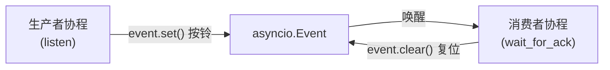
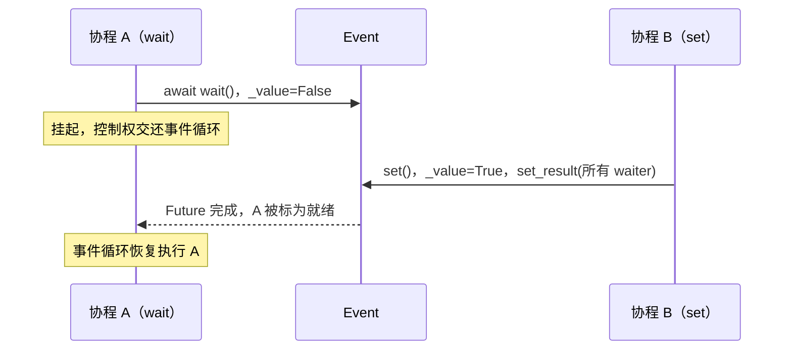
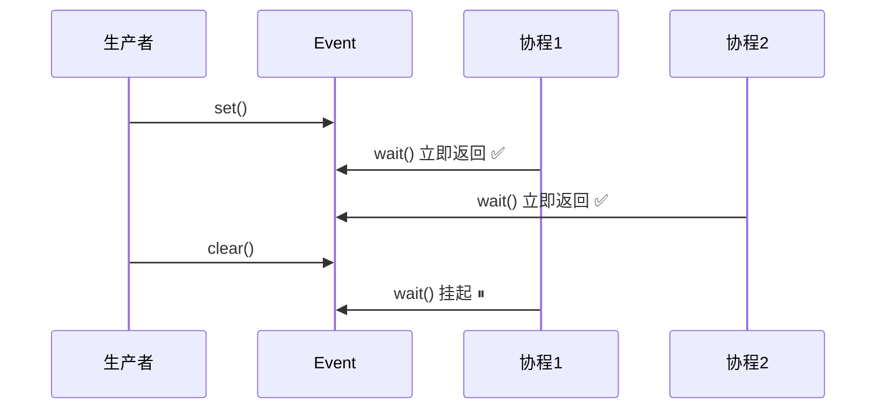
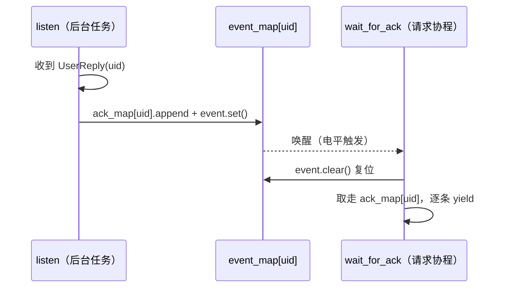

# asyncio.Event 详解

> 配套 mini-sglang 源码学习。本文讲清 `asyncio.Event` 的用法、底层原理与注意事项，并对照 [api_server.py](python/minisgl/server/api_server.py) 里的 `event_map` + `listen()` / `wait_for_ack()` 拆解「跨协程唤醒」这一异步模式。

## 目录

1. asyncio.Event 是什么
2. 基础用法
3. 与 threading.Event 的区别
4. 底层原理
5. 核心语义：电平触发
6. mini-sglang 实战：event_map + listen / wait_for_ack
7. Event / Condition / Queue 对比
8. 注意事项与最佳实践

---

## 一、asyncio.Event 是什么

**`asyncio.Event`** 是 asyncio 内置的**同步原语（synchronization primitive）**，用来在**协程之间**传递一个「有没有」的信号。

它只有两种状态：

- **未触发（unset）**：`wait()` 的协程会挂起等待。
- **已触发（set）**：`wait()` 的协程立即返回。

关键认知：**Event 是「信号」，不是「数据容器」**。它只回答「该不该醒」，至于「醒了之后要拿什么数据」，得靠别的容器来存——mini-sglang 里就是靠旁边的 `ack_map` 存数据、`event_map` 只发信号。

可以把它类比成一个「叫醒铃」：

| 操作 | 类比 |
|---|---|
| `set()` | 按下铃 |
| `clear()` | 把铃复位（停止响） |
| `await wait()` | 睡到铃响 |



---

## 二、基础用法

```python
import asyncio

evt = asyncio.Event()

async def producer():
    await asyncio.sleep(1)
    evt.set()                 # 拉响：唤醒所有在等 evt 的协程

async def consumer():
    await evt.wait()          # 挂起，直到 evt.set()
    evt.clear()               # （可选）把信号复位，方便下一轮等
    print("woken")

async def main():
    await asyncio.gather(producer(), consumer())

asyncio.run(main())
```

**API 一览：**

| 方法 | 说明 | 是否协程 |
|---|---|---|
| `Event()` | 构造，初始为未触发 | 否 |
| `set()` | 置为「已触发」，唤醒所有等待者 | 否（普通方法） |
| `clear()` | 置为「未触发」 | 否 |
| `is_set()` | 返回当前状态（bool） | 否 |
| `await wait()` | 已触发则立即返回 `True`；否则挂起直到 `set()` | 是 |

两个版本细节：

- **Python 3.10+**：`asyncio.Event()` 不再需要显式传 `loop`，它会在首次 `await wait()` 时绑定到「当前正在运行」的事件循环。
- **Python 3.11+**：直接 `asyncio.Event()` 即可；一个 Event 绑定一个事件循环，**跨 loop 使用会抛 `RuntimeError`**。

---

## 三、与 threading.Event 的区别

两者 API 长得几乎一样，但底层语义完全不同：

| | `threading.Event` | `asyncio.Event` |
|---|---|---|
| 服务对象 | 线程 | 协程 |
| 等待方式 | `evt.wait()`（**阻塞** OS 线程） | `await evt.wait()`（**挂起**协程） |
| 资源占用 | 阻塞 1 个线程 = 1 个 OS 栈 | 不占线程，事件循环可调度别的任务 |
| 唤醒方式 | 操作系统调度 | 事件循环把协程标为就绪 |
| 适用 | 多线程协作 | 单线程异步、协程协作 |

核心差别一句话：**`asyncio.Event.wait()` 是「协作式」的**——它挂起当前协程、把控制权交还给事件循环，而不是白白占住一个线程。这也是为什么 mini-sglang 的 API Server 里，几百个请求协程可以同时 `wait_for_ack` 而只用一个事件循环线程。

---

## 四、底层原理

`asyncio.Event` 的实现极其简单，CPython 里就是 **一个 bool 状态位 + 一个等待者队列**（见 `Lib/asyncio/locks.py`）。简化示意：

```python
import collections

class Event:
    def __init__(self):
        self._value = False                  # 状态位
        self._waiters = collections.deque()  # 挂起的协程

    def is_set(self):
        return self._value

    def set(self):
        if not self._value:
            self._value = True
            for fut in self._waiters:        # 遍历所有等待者
                if not fut.done():
                    fut.set_result(True)     # 逐个唤醒
            # 每个 wait() 的 finally 会把自己从 _waiters 移除

    def clear(self):
        self._value = False

    async def wait(self):
        if self._value:                      # 已经 set：直接返回，不挂起
            return True
        fut = self._get_loop().create_future()
        self._waiters.append(fut)
        try:
            await fut                        # 挂起，等 set() 里 fut.set_result()
            return True
        finally:
            self._waiters.remove(fut)
```

逐行看三个关键点：

1. **`wait()` 先查 `_value`，为 `True` 就直接返回**——这就是「电平触发」的来源（下一节详述）。
2. **`wait()` 挂起 = `await` 一个 Future**。协程等 `fut` 的时候，事件循环转去跑别的任务；`set()` 里 `fut.set_result(True)` 会把该 Future 标记完成，事件循环下一轮再把等它的协程重新排进就绪队列。
3. **`set()` 唤醒的是「所有」等待者**（广播），不是只醒一个。所以它底层依赖的是 **Future**，而不是锁，也不涉及任何线程同步。



---

## 五、核心语义：电平触发（level-triggered）

这是理解 Event 行为、避免踩坑的钥匙。

**电平触发**：`wait()` 判断的是「**当前这一刻**是否处于 set 状态」，而不是「自从上次 clear 之后有没有**发生过一次** set」（后者叫边沿触发）。

由此推出三条直接后果：

**1. set 之后、clear 之前，任意多个协程 wait 都会立即返回。**



**2. set 发生在 wait 之前也不会丢信号。** 消息先到、协程晚到，`wait()` 照样立即返回——这正是 `wait_for_ack` 能放心直接 `await event.wait()` 的原因：即使 `listen()` 先 `set()`、请求协程还没开始等，也不会漏掉这次唤醒。

**3. 代价是可能「多醒一次」。** 因为电平触发只关心「现在 set 了」，醒来后状态可能又变了（被 `clear()` 了、或数据被别人取走了），这时协程要**自行检查真正的条件**。mini-sglang 里对应的兜底就是 `wait_for_ack` 里的 `ack = None` 哨兵（见第六节）。

> 对比边沿触发（如 `Semaphore`、epoll 的 EPOLLET）：边沿触发会「计数」发生的次数、每次只唤醒一个等待者；电平触发不计数、广播唤醒。两者适用场景不同，Event 选电平是为了「宁可多醒，不可漏醒」。

---

## 六、mini-sglang 实战：event_map + listen / wait_for_ack

`event_map: Dict[int, asyncio.Event]`（[api_server.py:113](python/minisgl/server/api_server.py#L113)）是「uid → 唤醒事件」的表，配合 `ack_map` 把混流的回复按 `uid` 拆回各自的请求。三处代码串起完整链路：

**① 创建**（`new_user()`，[api_server.py:117-121](python/minisgl/server/api_server.py#L117-L121)）：

```python
self.ack_map[uid] = []              # 数据：攒回复
self.event_map[uid] = asyncio.Event()  # 信号：通知有新回复
```

**② 生产者 `set()`**（`listen()`，[api_server.py:123-130](python/minisgl/server/api_server.py#L123-L130)）：

```python
async def listen(self):
    while True:
        msg = await self.recv_tokenizer.get()
        for msg in _unwrap_msg(msg):
            if msg.uid not in self.ack_map:
                continue
            self.ack_map[msg.uid].append(msg)   # 先放数据
            self.event_map[msg.uid].set()       # 再按铃通知
```

**③ 消费者 `wait()` + `clear()`**（`wait_for_ack()`，[api_server.py:143-161](python/minisgl/server/api_server.py#L143-L161)）：

```python
async def wait_for_ack(self, uid: int):
    event = self.event_map[uid]
    while True:
        await event.wait()          # 等铃响
        event.clear()               # 立刻复位，否则下一轮空转
        pending = self.ack_map[uid]
        self.ack_map[uid] = []      # 取走数据
        ack = None
        for ack in pending:
            yield ack
        if ack and ack.finished:
            break
    del self.ack_map[uid]
    del self.event_map[uid]
```



三个值得记住的要点：

1. **`clear()` 必须紧跟 `wait()` 之后**。因为电平触发，不清的话 `_value` 一直是 `True`，下一轮 `await event.wait()` 会「瞬间通过」空转。
2. **`ack = None` 哨兵处理「多醒一次」**。极端情况下 event 被 set 但 `pending` 为空，`ack` 会残留上一轮的旧值；先置 `None` 保证 `if ack and ack.finished` 不误判。
3. **信号与数据解耦**：`event_map` 只回答「有没有新东西」，`ack_map` 才存「新东西是什么」。两个 dict 分开，职责清晰。

---

## 七、Event / Condition / Queue 对比

三个都是协程同步原语，容易混淆，一张表说清：

| 原语 | 携带数据 | 通知粒度 | 丢信号？ | 何时用 |
|---|---|---|---|---|
| **Event** | 否 | 广播（唤醒所有） | 不丢（电平） | 只需「有 / 无」信号 |
| **Condition** | 否（配合共享变量） | `notify(n)` / `notify_all()` 精确控制 | 不丢（需谓词） | 需要精确唤醒 + 条件判断 |
| **Queue** | 是 | 生产者 / 消费者 | 不丢（有缓冲） | 直接传数据本身 |

**选择口诀：**

- 只通知「有变化了」，数据放别处 → **Event**（最轻）。
- 要「只叫醒其中一个」或「满足某个条件才醒」 → **Condition**（`notify(n=1)` 精确唤醒 + 谓词判断）。
- 要直接把数据从 A 递给 B → **Queue**（自带缓冲和背压）。

mini-sglang 的 `FrontendManager` 用的是「**Event + 手动 dict**」的组合，本质上等价于一个「按 `uid` 分区的 Condition/Queue」，但更轻、更直白，不需要 Condition 的谓词协议。

---

## 八、注意事项与最佳实践

### 常见坑

| 坑 | 现象 | 解法 |
|---|---|---|
| **忘记 `clear()`** | 下一轮 `wait()` 空转（电平触发） | `wait()` 返回后**立刻** `clear()` |
| **跨 loop 使用** | `RuntimeError` | 一个 Event 绑定一个事件循环，别跨 loop 传 |
| **把 Event 当数据容器** | `wait()` 后拿不到数据 | Event 只做信号，数据用单独容器（如 `ack_map`）存 |
| **「先 is_set 再 wait」竞态** | 极端时序下可能漏信号 | 直接 `await evt.wait()`，别用 `is_set()` 预判断（`wait()` 本身不丢信号） |
| **误以为只醒一个** | 一次 `set()` 唤醒**所有** waiter | 要精确唤醒用 `Condition.notify(n)` |
| **把 set 当累加** | 多次 `set()` 一次 `clear()` 就归零 | 需要计数用 `Semaphore` |
| **不检查醒来后的真实条件** | 多醒一次时误判 | 醒来后重新检查数据/状态（如 `ack` 哨兵） |

### 最佳实践速记

1. **`wait()` 返回后立刻 `clear()`**——这是防「电平触发空转」的标配。
2. **信号与数据解耦**：Event 只负责「通知」，数据放独立容器，别塞进 Event。
3. **直接 `await evt.wait()`**，不要「先 `is_set()` 再 `wait()`」——电平触发下 `wait()` 不会丢信号，多此一举反而引入竞态。
4. **一个 Event 只在一个事件循环里用**，不要跨 `asyncio.run()` / 跨线程传递。
5. **醒来后重新验证真实条件**——接受「多醒一次」，用哨兵或再次判断来兜底。
6. **选对原语**：只是「有没有」用 Event；要传数据用 Queue；要精确唤醒用 Condition。

---

## 参考

- Python 官方文档 · 同步原语：<https://docs.python.org/3/library/asyncio-sync.html>
- CPython 源码 · Event 实现：`Lib/asyncio/locks.py`
- 本项目：[server/api_server.py](python/minisgl/server/api_server.py)（`event_map`、`listen()`、`wait_for_ack()`）、[server/args.py](python/minisgl/server/args.py)
